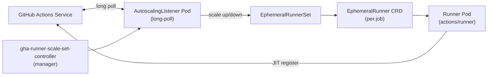
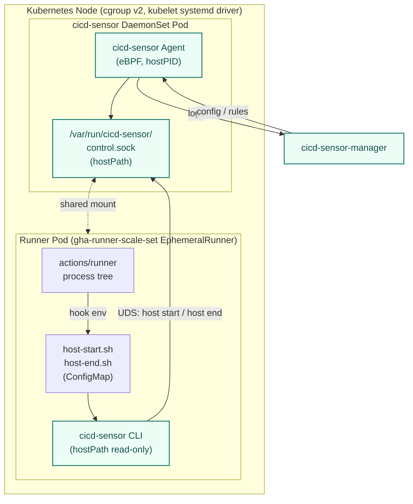

# Design Doc: GitHub Actions Runner Controller (ARC) Support

## 1. Goal

Add cicd-sensor support for GitHub Actions jobs running under
**Actions Runner Controller (ARC) — `gha-runner-scale-set`** on Kubernetes,
delivering the same Summary / Detection / Runtime Event log streams that
the Self-hosted Machine Runner already produces.

The runner environment moves from *one VM = one runner = one job* to
*one Pod = one runner = one job* on a shared Kubernetes node, so the
Agent placement, control-socket transport, cgroup-tracking seed, and
listener trust model all need to be re-grounded for that boundary.

See [`docs/user-guide/overview.md`](../docs/user-guide/overview.md) —
ARC is listed there as **Planned**, and
[`docs/developer-guide/agent.md`](../docs/developer-guide/agent.md) Provider Flow
already calls out *"NRI / Pod metadata and similar options are under
consideration"*. This doc commits to a concrete approach for that row.

## 2. Non-goals

- Legacy ARC modes (`RunnerDeployment`, `AutoscalingRunnerSet` v1 / legacy CRD).
  Out of scope. We target `gha-runner-scale-set` only, since legacy ARC is
  community-maintained and not the path GitHub Actions Service is investing in
  ([`docs.github.com — Runner scale sets`](https://docs.github.com/en/actions/concepts/runners/runner-scale-sets)).
- **GitLab Kubernetes executor and GitLab Runner Operator.** Adjacent but
  separate Provider Flow row. Concrete design ships in its own doc — but
  we are explicit in §12 about what this design must keep reusable so the
  GitLab work isn't blocked or forced into a different shape. Lessons
  here will inform that work; the implementation is not shared until the
  GitLab design doc lands.
- A bespoke Kubernetes operator for cicd-sensor itself. We rely on a flat
  DaemonSet plus a small Helm overlay for the ARC chart. No new CRDs.
- Cluster-policy enforcement (e.g. denying runner pods that opt out of
  cicd-sensor). Logging / detection is the scope; enforcement is left to
  upstream admission control.

## 3. Target versions

Pinned baselines used while designing. Concrete CI matrix to be agreed
during implementation.

| Component | Version assumed | Source |
| --- | --- | --- |
| `gha-runner-scale-set` chart / controller | `0.14.0` (Mar 2026 GA) | [ARC 0.14.0 changelog](https://github.blog/changelog/2026-03-19-actions-runner-controller-release-0-14-0/) |
| `actions/runner` image (runner container) | `ghcr.io/actions/actions-runner:latest` (matches chart default) | [`values.yaml`](https://github.com/actions/actions-runner-controller/blob/master/charts/gha-runner-scale-set/values.yaml) |
| Kubernetes | `1.25+` (cgroup v2 GA) | [k8s 1.25 cgroup v2 GA](https://kubernetes.io/blog/2022/08/31/cgroupv2-ga-1-25/) |
| Kubelet cgroup driver | `systemd` (recommended for cgroup v2) | [k8s: About cgroup v2](https://kubernetes.io/docs/concepts/architecture/cgroups/) |
| containerd | `2.x` (NRI v0.12) | [containerd 2.3.0 release notes](https://github.com/containerd/containerd/releases/tag/v2.3.0) |
| Linux kernel | `5.15+` on amd64 / `6.1+` on arm64 (same baseline as host install) | [`docs/user-guide/github-hosted.md`](../docs/user-guide/github-hosted.md) |

cgroup v1 nodes are unsupported. Cluster operators on cgroup v1 must upgrade
node OS before adopting cicd-sensor on ARC. This matches the existing host
agent's cgroup v2 requirement
([`docs/developer-guide/ebpf-runtime.md`](../docs/developer-guide/ebpf-runtime.md)).

## 4. Background: ARC `gha-runner-scale-set`



Per-job lifecycle:

1. Listener long-poll receives a job assignment from GitHub Actions Service.
2. Controller patches the `EphemeralRunnerSet` to desired replicas;
   one `EphemeralRunner` CRD is created per pending job and the controller
   acquires a JIT registration token.
3. Runner pod starts with that JIT token, registers with GitHub, and the
   actions/runner binary picks up exactly one job.
4. On job completion the controller asks Actions Service whether the runner
   can be deleted, then deletes the pod and CRD.

Pod template uses `template.spec.*` (a real PodSpec subset), supporting
extra `volumes`, `volumeMounts`, `env`, and `lifecycle` hooks
([ARC `values.yaml`](https://github.com/actions/actions-runner-controller/blob/master/charts/gha-runner-scale-set/values.yaml)).

Container modes:

| `containerMode.type` | What it produces | Note |
| --- | --- | --- |
| `dind` | Runner container + dind sidecar (privileged), `/var/run/docker.sock` over emptyDir | Job containers run inside the pod via dockerd |
| `kubernetes` | Runner container only; `runner-container-hooks` spawns job/service/step containers as **separate pods** via the k8s API | Job pods are sibling resources, not children of the runner pod |
| `kubernetes-novolume` | Same as `kubernetes` without PVC | Same tracking implications as `kubernetes` |

This affects what we have to track. See §7.

## 5. Decisions

| Decision | Choice | Reasoning |
| --- | --- | --- |
| ARC mode targeted | `gha-runner-scale-set` only | GitHub-supported path; legacy ARC has no migration runway. |
| Agent placement | **DaemonSet on each worker node**, one Agent per node | Keeps eBPF privilege in one place per node, matches existing one-Agent-per-host model, reuses `host start` flow. |
| Scope owner | **Host scope** by default | Clusters that run ARC are operated by a platform team — they own the runner host, exactly like the self-hosted machine case. Project scope (action) can be layered later. |
| Control transport | Unix socket on **`hostPath`**, mounted read-write into each runner pod | No new RPC surface; reuses `cmd/cicd-sensor host start`. |
| Hook delivery | `ACTIONS_RUNNER_HOOK_JOB_STARTED` / `_COMPLETED` env vars + a hook script ConfigMap, both injected into `template:` via Helm values | Same env vars the actions/runner already honors on self-hosted; no runner image fork. |
| Agent binary distribution to runner pod | `hostPath` mount of `/opt/cicd-sensor/cicd-sensor` (read-only) | Mirrors the self-hosted install layout; avoids shipping the binary inside a ConfigMap or maintaining a custom runner image. |
| cgroup seed | Resolve peer PID via `SO_PEERCRED` on the host socket, read `/proc/<pid>/cgroup` to land on `kubepods.slice/...`-anchored pod cgroup | DaemonSet runs with `hostPID: true` so `/proc/<pid>` resolves to the runner-pod process. |
| Container-mode coverage | Phase 1: `dind` only (descendant cgroup tracking is sufficient — no sibling pod problem). | `kubernetes` mode needs sibling job-pod tracking; deferred to Phase 2 (§9). |
| NRI plugin | Not used in v1 | NRI v1.0 is not yet stable as of containerd 2.3.0 (NRI v0.12). Re-evaluate once NRI v1.0 ships and we want to drop the host socket. |
| **Config delivery split** | **Dynamic cicd-sensor config (RuleSet / RuleModifier / OutputSettings / blocks) is delivered through cicd-sensor-manager at runtime. ARC values overlay carries *only* static plumbing (hostPath mounts, hook env-var pointers, ConfigMap name).** | Mutating `AutoscalingRunnerSet.spec.template` causes ARC to recreate `EphemeralRunnerSet` → all runner pods (and listener pods) get recreated → **in-flight jobs are interrupted**. cicd-sensor settings change far more frequently than its plumbing, so the two have to be on separate update paths. Manager-driven config is the existing mechanism for host scope and already supports hot updates. |
| **ASRS template stability rule** | Once the ARC values overlay is installed, it is treated as **frozen**: rule changes, output destination changes, detection on/off, block lists — none of these touch ARC values. The only triggers for a values change are cicd-sensor major upgrades that alter the mount surface. | Makes the operational contract concrete: "editing rules will never restart your runners." Mirrors the contract self-hosted machine runners already have. |
| **Per-scale-set host scope** (multi-tenancy of host scope) | Allow **multiple host-scope instances per Agent, keyed by ARC scale-set identity** (`actions.github.com/scale-set-namespace` + `actions.github.com/scale-set-name` pod labels). Each scale set gets its own RuleSet / RuleModifier / OutputSettings. The Agent resolves a job's scale-set from the runner pod's labels and dispatches to the matching scope. | A k8s cluster running ARC commonly hosts several `AutoscalingRunnerSet` resources, each owned by a different team with different security postures (e.g. prod-deploy scale-set = strict blocks; CI-test scale-set = relaxed). The existing "1 host = 1 host scope owner" assumption breaks. Splitting one DaemonSet per scale set was rejected (eBPF duplication, socket conflicts — §11). The broader concept is multi-tenancy; we name the implementation after the concrete boundary (scale-set) instead of the generic concept, because (a) the resolver only looks at scale-set labels today, and (b) generalising prematurely would force GitLab K8s and other future runners into a shape they may not fit. |
| Scale-set identity source | ARC-set pod labels resolved via **namespaced `get pods` RBAC** for the DaemonSet — labels are written by the ARC controller, not the runner pod, so they cannot be forged from inside the runner pod. | Trust anchor for scale-set routing must come from the k8s control plane, not from the runner. Env vars set inside the pod template would be spoofable by any user with kubectl edit on a workload manifest. |

## 6. Architecture



Component responsibilities:

| Component | Lives in | Responsibility |
| --- | --- | --- |
| Agent DaemonSet | Node-level pod | Loads eBPF, exposes `/var/run/cicd-sensor/control.sock` via hostPath, owns KernelTracker + JobRegistry. Same binary as self-hosted, configured for ARC provider routing. |
| Hook ConfigMap | Cluster | Holds `host-start.sh` / `host-end.sh`. Mounted into every runner pod at `/opt/cicd-sensor/hooks/`. |
| Agent CLI mount | hostPath into runner pod | Read-only mount of `/opt/cicd-sensor/cicd-sensor` so the hook script can call into the control socket without rebuilding the runner image. The binary is placed on the node by the DaemonSet's `install-cli` initContainer (§8.1) — never by a node-side shell installer — so CLI and Agent versions stay locked together. |
| Helm values overlay | User cluster | Patches `template:` of the ARC `gha-runner-scale-set` release with extra `volumes` / `volumeMounts` / `env` and the hook env vars. |

The Agent process is the same binary the host-machine install uses. The only
agent-side delta is identifying the **node** as the "host" and treating the
**control socket** path as cluster-shared. No new RPC service is introduced.

## 7. Identity, lifecycle, and cgroup tracking

### 7.1 Identity flow

The actions/runner inside the runner pod is the same binary used on
self-hosted machine runners and exports the same env vars before it hits
the start hook:

`GITHUB_*` (run id, job, run attempt) and `RUNNER_TRACKING_ID`.

`host-start.sh` is a one-line shim:

```sh
#!/usr/bin/env sh
exec /opt/cicd-sensor/cicd-sensor host start
```

`cmd/cicd-sensor host start` already reads those env vars
([`docs/user-guide/github-self-hosted.md`](../docs/user-guide/github-self-hosted.md))
and resolves the peer cgroup via `SO_PEERCRED`. On ARC the peer PID belongs
to the actions/runner process inside the runner pod — but because the
DaemonSet runs with `hostPID: true`, `/proc/<pid>/cgroup` resolves to the
**node-visible cgroup path** under `kubepods.slice/.../<pod-uid>.slice/...`.

That node-visible path is what gets installed into `tracked_cgroups` — and
because cgroup-v2 events from the kernel use the same numeric cgroup IDs,
descendants spawned inside the runner pod (job processes, dockerd children,
container runtime children) are observed by the existing eBPF code without
modification.

### 7.2 Pod-cgroup discovery

ARC runner pods get pod cgroups created by the kubelet under
`kubepods.slice` (or QoS-bucketed siblings, e.g.
`kubepods-burstable.slice/kubepods-burstable-pod<uid>.slice`) when the
systemd cgroup driver is in use. cicd-sensor does **not** need to know the
slice convention — it only needs the cgroup ID of the seed PID, which the
kernel already gives us.

What we **do** need on the cluster side:

- Kubelet cgroup driver = systemd (warn / fail-fast on cgroupfs nodes).
- cgroup v2 unified hierarchy (already required by the agent).
- DaemonSet pod mounts `/sys/fs/cgroup` (cgroup v2 root) read-only and
  `/proc` from the host (implicit with `hostPID`).

### 7.3 Recursive tracking — is it needed?

Today's tracker handles "container created by host-side dockerd" via the
**Docker proxy + staging promote** pattern, because the new container's
cgroup is not a descendant of the seed cgroup.

On ARC the situation is different:

- `containerMode: kubernetes` — job containers are **separate pods**
  spawned by `runner-container-hooks` through the k8s API. Those pods get
  their own pod cgroups under `kubepods.slice`, *not* descendants of the
  runner pod cgroup. **Staging promote needs an ARC analogue**, or those
  events are missed.
- `containerMode: dind` — dockerd runs as a sidecar inside the runner pod.
  Containers it creates get cgroups *inside the pod's cgroup namespace*,
  i.e. descendants of the runner pod cgroup. No staging needed — the
  existing `cgroup_mkdir` + descendant-track behavior is sufficient.

This shapes the phased plan in §9: dind is the cheaper first cut, even
though `kubernetes` mode is more "Kubernetes-native".

### 7.4 Listener trust model adaptation

Today, `host start` from a self-hosted machine runner has its peer-credential
check verify the peer UID belongs to the agent process owner
([`docs/developer-guide/agent.md`](../docs/developer-guide/agent.md) §Listener
trust model). On ARC, the peer is the actions/runner process inside the
runner pod, running as the actions runner user — **not** the DaemonSet's UID.

Two options:

| Option | Description | Tradeoff |
| --- | --- | --- |
| **A** Drop UID check on `host/start` for ARC provider | Accept any peer; rely on the peer's cgroup being a recognizable pod cgroup under `kubepods.slice` as the trust anchor | Simpler. Trust shifts from "owner UID" to "lives under kubepods cgroup" — defensible because untrusted local users on the runner pod aren't in scope. |
| **B** Run runner pods with `runAsUser` matching the Agent DaemonSet UID | Preserve the existing UID check | Forces a global Helm policy on operators; conflicts with existing image conventions; brittle. |

Recommendation: **A**, with the check rephrased as *"peer cgroup must be a
known runner pod cgroup"*. Implementation lives in a new provider-flow
branch (`provider = github-arc`).

## 8. Manifest layout

### 8.1 Agent DaemonSet (sketch)

Captures the privileges and mounts needed. Final values to be tuned during
implementation.

```yaml
apiVersion: apps/v1
kind: DaemonSet
metadata: { name: cicd-sensor-agent, namespace: cicd-sensor }
spec:
  selector: { matchLabels: { app: cicd-sensor-agent } }
  template:
    metadata: { labels: { app: cicd-sensor-agent } }
    spec:
      hostPID: true
      initContainers:
        - name: install-cli
          image: ghcr.io/cicd-sensor/cicd-sensor-agent:<version>
          command: ["/bin/sh", "-c"]
          # Same image as the main agent container; copy the CLI binary
          # to a hostPath that runner pods will mount read-only. Using
          # the same image guarantees Agent and CLI versions match.
          args:
            - |
              set -eu
              install -m 0755 /usr/local/bin/cicd-sensor /host-cli/cicd-sensor.new
              mv /host-cli/cicd-sensor.new /host-cli/cicd-sensor
          volumeMounts:
            - { name: cli, mountPath: /host-cli }
      containers:
        - name: agent
          image: ghcr.io/cicd-sensor/cicd-sensor-agent:<version>
          securityContext:
            privileged: true   # or: capabilities { add: [BPF, SYS_ADMIN, PERFMON, NET_ADMIN] }
          volumeMounts:
            - { name: cgroupfs, mountPath: /sys/fs/cgroup }
            - { name: bpffs,    mountPath: /sys/fs/bpf, mountPropagation: Bidirectional }
            - { name: control,  mountPath: /var/run/cicd-sensor }
      volumes:
        - { name: cgroupfs, hostPath: { path: /sys/fs/cgroup, type: Directory } }
        - { name: bpffs,    hostPath: { path: /sys/fs/bpf,    type: DirectoryOrCreate } }
        - { name: control,  hostPath: { path: /var/run/cicd-sensor, type: DirectoryOrCreate } }
        - { name: cli,      hostPath: { path: /opt/cicd-sensor, type: DirectoryOrCreate } }
```

CLI distribution is owned by the **`install-cli` initContainer**: it
ships the same image as the main `agent` container and copies the CLI
binary to the `/opt/cicd-sensor` hostPath. The runner pods then mount
that hostPath read-only (see §8.2). The atomic `install + mv` pattern
keeps in-flight runner-pod hook invocations from observing a
partially-written binary during DaemonSet rollouts.

Reusing the same image for the initContainer guarantees the CLI version
on disk and the Agent version in memory cannot drift — the Kubernetes
image pull resolves to one digest for both. No separate shell-script
installer on the node, and no extra release artifact to publish.

The `agent` container does not mount `/opt/cicd-sensor` itself; the
hostPath exists purely to be re-mounted into runner pods.

### 8.2 ARC values overlay (sketch)

Mounts the control socket and CLI into each runner pod, ships a hook
ConfigMap, sets the env vars.

```yaml
template:
  spec:
    containers:
      - name: runner
        env:
          - { name: ACTIONS_RUNNER_HOOK_JOB_STARTED,   value: /opt/cicd-sensor/hooks/host-start.sh }
          - { name: ACTIONS_RUNNER_HOOK_JOB_COMPLETED, value: /opt/cicd-sensor/hooks/host-end.sh }
        volumeMounts:
          - { name: cicd-sensor-control, mountPath: /var/run/cicd-sensor }
          - { name: cicd-sensor-cli,     mountPath: /opt/cicd-sensor/cicd-sensor, subPath: cicd-sensor, readOnly: true }
          - { name: cicd-sensor-hooks,   mountPath: /opt/cicd-sensor/hooks, readOnly: true }
    volumes:
      - { name: cicd-sensor-control, hostPath: { path: /var/run/cicd-sensor, type: Directory } }
      - { name: cicd-sensor-cli,     hostPath: { path: /opt/cicd-sensor,     type: Directory } }
      - { name: cicd-sensor-hooks,   configMap: { name: cicd-sensor-hooks, defaultMode: 0o755 } }
```

We will publish this as a ready-to-use overlay (Helm sub-chart or values
file) under `deploy/arc/` so cluster operators do not assemble it by hand.

### 8.3 Hook ConfigMap

```yaml
apiVersion: v1
kind: ConfigMap
metadata: { name: cicd-sensor-hooks, namespace: <arc-namespace> }
data:
  host-start.sh: |
    #!/usr/bin/env sh
    exec /opt/cicd-sensor/cicd-sensor host start
  host-end.sh: |
    #!/usr/bin/env sh
    exec /opt/cicd-sensor/cicd-sensor host end
```

## 9. Phased delivery

Phase 1 is intentionally larger than the original sketch because
**per-scale-set host scope is in-scope from MVP** — single-scale-set ARC
support would not meet the per-`AutoscalingRunnerSet` isolation
requirement that real cluster operators have, and bolting scale-set
keying on later would change the wire format and migrate users twice.

| Phase | Scope | Deliverable |
| --- | --- | --- |
| **0 Design** | Land this doc. Align on Agent placement, scope owner, config-delivery split, multi-tenancy model. | `designs/arc-support.md` (this file). |
| **1 dind happy path + per-scale-set isolation (MVP)** | `containerMode: dind`, hook-driven `host start` / `host end`, descendant cgroup tracking only (no sibling job-pod tracking). **Per-scale-set host scope keyed by ARC scale-set labels, with manager-delivered per-scale-set config.** Static-plumbing-only ARC values overlay; dynamic config delivered through the manager. | (a) Agent code: `provider=github-arc` route, listener trust mode "peer cgroup under `kubepods.slice`", scale-set resolution via cached `get pods` watch, manager-config request carries the resolved scale-set. (b) Manager / wire: `FetchConfigRequest.arc_scale_set` is honored when present and the manager returns the matching per-scale-set config. (c) Manifests: Agent DaemonSet (with `install-cli` initContainer + namespaced `get pods` RBAC), Hook ConfigMap, ARC values overlay. (d) Tests: e2e against kind + ARC chart with two scale sets and divergent rule sets verifying isolation. (e) Docs: `docs/user-guide/github-arc.md`, update Platform support table. |
| **2 `kubernetes` mode** | Track sibling job pods spawned via `runner-container-hooks`. Introduce an ARC-shaped analogue of staging promote (pod-cgroup level), keyed on `EphemeralRunner` / pod owner references discovered through the k8s API or `runner-container-hooks` notifications. Sibling pods inherit the runner pod's scale-set. | KernelTracker primitive review; new staging-by-pod-uid map; integration tests for stepped-up container coverage. |
| **3 Project scope on ARC** | Allow `cicd-sensor-action` to ride alongside the host-scope agent (same as today on GitHub-hosted). | Listener handler reuse; verify two-scope isolation under k8s. |
| **4 NRI alternative** | Replace control socket on dind path with NRI plugin once containerd ships NRI v1.0 GA and we have a clear win (no host socket, fewer privileges in runner pods). | Behind a build/config flag, fallback to hook path. |

Phases 1 + 2 are the MVP for "ARC supported". Phases 3 + 4 are
incremental. Each phase ends with a release-note flag on the platform
support table in `docs/user-guide/overview.md`.

### 9.1 What Phase 1 explicitly does *not* require

These would each be reasons to mutate the ARC values overlay, and so are
deliberately routed elsewhere:

- Adding a detection rule, modifying a `RuleModifier`, toggling
  `enabled` on a rule → **Manager push**, no ARC change.
- Changing the output sink for a scale set (e.g. switching S3 bucket) →
  **Manager push** keyed by scale-set, no ARC change.
- Onboarding a new scale set → **Manager-side per-scale-set config
  addition** plus the standard ARC values overlay applied to the new
  scale-set chart release. The existing scale sets are untouched.
- Pausing detection for a scale set during incident → **Manager push** of
  an empty / pass-through per-scale-set config, no ARC change.

The only Phase 1 changes that *would* require touching ARC values (and
therefore are framed as planned maintenance windows) are: cicd-sensor
agent upgrade that changes the mount surface, or migration of the hook
ConfigMap layout. These are expected to be very rare.

## 10. Open questions

1. **Job-pod tracking signal.** `runner-container-hooks` is what spawns
   job/service/step pods in `kubernetes` mode. Do we (a) shim
   `runner-container-hooks` via env var override to also notify the Agent
   over the same control socket, or (b) watch the k8s API for pods owned
   by the runner pod? (a) is simpler but adds a maintained component;
   (b) requires the DaemonSet to have list/watch on pods in the runner
   namespace. Decision deferred to Phase 2 kickoff.
2. **DaemonSet upgrade strategy.** Replacing the Agent pod tears down
   `tracked_cgroups` mid-flight. Need a documented drain procedure or a
   per-node disable label that the ARC runner scheduling respects. Likely
   a pre-stop hook that refuses new `host start` and waits for active
   jobs to finish.
3. **Multi-team clusters.** Several `gha-runner-scale-set` releases can
   exist on one cluster. The Agent treats them as a single trust domain
   on the same node and isolates only their host scope **configuration**
   per scale-set — is that acceptable when different teams own different
   scale sets, or do we need per-namespace agent isolation? Likely
   acceptable for v1 (matches GitHub-hosted node model), revisit if
   real-world deployments push back.
4. **Architecture coverage.** Runner pods on Graviton (arm64) need the
   arm64 kernel baseline (6.1+) already documented for self-hosted.
   Verify ARC's default amd64 image set and decide whether we publish
   arm64 manifests in v1 or in a follow-up.

> **Resolved:** *Binary distribution to runner pod.* The DaemonSet's
> `install-cli` initContainer copies the CLI from the same Agent image
> onto a hostPath, and runner pods mount that hostPath read-only. This
> avoids a node-side shell installer (which would drift from the Agent
> version) and avoids per-runner-pod initContainer copies (which would
> add startup latency to every job). See §8.1.

## 11. Out-of-scope alternatives considered

| Alternative | Why not (now) |
| --- | --- |
| Sidecar Agent in each runner pod | Multiplies eBPF privilege across every pod, fights with ephemeral pod startup latency, complicates resource accounting. Revisit only if a node-level Agent is impossible in the target environment. |
| Custom runner image with cicd-sensor pre-baked | Forces operators onto a non-GitHub image; loses upstream security updates; we still need a node-level Agent for eBPF. Net negative. |
| NRI plugin (in v1) | Promising but premature — NRI v1.0 has not GA'd in containerd, CRI-O parity lags, and we would still need the eBPF path. Track for Phase 4. |
| `kubernetes` mode only (skip dind) | Most teams that adopt ARC also adopt dind for image builds. Dropping dind in v1 would leave the most popular use case unsupported. |

## 12. Future: GitLab Kubernetes equivalent

This is a forward-looking note, not a v1 commitment. Its purpose is to
keep this design from accidentally narrowing the road for the GitLab
Kubernetes work that the project already lists as **Planned** in
[`docs/user-guide/overview.md`](../docs/user-guide/overview.md).

### 12.1 GitLab landscape (as of 2026-06)

There is no direct ARC analogue on the GitLab side — i.e. no GitLab-supplied
controller that produces one runner pod per job with JIT-style registration
and a per-job CRD. The closest pieces are:

| Component | What it is | Equivalent to ARC concept |
| --- | --- | --- |
| **GitLab Runner Kubernetes executor** | A long-lived runner pod / process whose `config.toml` selects the `kubernetes` executor. The runner uses the Kubernetes API to spawn a build pod (with `build` + `helper` + service containers) per CI job. | Closest to ARC `containerMode: kubernetes` — one job, one pod, sibling to the runner. The runner itself is not ephemeral; it stays up and accepts more jobs. |
| **GitLab Runner Helm chart** (`gitlab/gitlab-runner`) | Official Helm chart that deploys the runner Deployment with executor config. | ARC chart's runner-side equivalent (no separate controller / listener split). |
| **GitLab Runner Operator** (`apps.gitlab.com/v1beta2`, `Runner` CRD; OperatorHub stable) | An installer / lifecycle wrapper around the same runner. Officially targeted at OpenShift but works on vanilla k8s. | A CRD wrapper for the long-lived runner. **Does not change job execution semantics** — jobs still go through the Kubernetes executor inside the runner pod. |
| `alekc/gitlab-runner-operator` | Community alpha operator. | Not relevant to design decisions. |

The headline implication: **the per-job tracking problem on GitLab
Kubernetes is structurally identical to ARC `containerMode: kubernetes`
(Phase 2 in this doc)**. The GitLab Runner Operator does not introduce a
per-job CRD that we have to integrate with. The runner-pod itself is the
seed, and the job pod is a sibling that needs the same staging-promote
analogue we build for ARC.

### 12.2 What from this design must stay reusable

The following decisions in this doc should be implemented in a way that
admits the future GitLab provider without rework:

1. **Agent placement and privilege model.** The DaemonSet + hostPath
   control socket pattern (§6, §8) is provider-agnostic. The same
   DaemonSet image must be able to serve both `provider=github-arc` and
   a future `provider=gitlab-k8s` — selecting between them by config,
   not by build. Don't bake GitHub-specific assumptions into the
   DaemonSet manifest.
2. **Sibling pod tracking primitive (Phase 2).** Whatever we add for ARC
   `kubernetes` mode to attribute sibling job pods to the right Job —
   whether that lands in KernelTracker as a new primitive, or in a
   pod-watch helper — must accept GitLab job pods too. Specifically:
   the linkage from sibling pod → owning Job must be expressed in
   neutral terms (e.g. pod UID / owner reference / labels), not in
   GitHub-only identifiers.
3. **Listener trust-model relaxation.** The §7.4 change ("peer cgroup
   must live under `kubepods.slice`") is also the right anchor for
   GitLab on k8s. We should phrase it as a generic k8s-runner trust
   mode, not as an ARC-specific exception.
4. **`docs/developer-guide/agent.md` Provider Flow row.** When we land
   ARC, the existing single row
   *"GitHub ARC / GitLab Kubernetes executor | Planned | TBD | NRI / Pod
   metadata and similar options are under consideration"*
   should split into two rows — one filled in for ARC, one still
   *Planned* for GitLab — rather than being collapsed back into one
   ARC-specific entry. That keeps the GitLab work visibly on the roadmap.

### 12.3 What will be different on the GitLab side

These differences are not problems for the ARC v1 design, but they are
the items a future GitLab Kubernetes design doc will have to resolve.

| Concern | ARC (this doc) | GitLab Kubernetes (future) |
| --- | --- | --- |
| Lifecycle hook delivery | `ACTIONS_RUNNER_HOOK_JOB_STARTED/COMPLETED` env vars on the runner pod | GitLab Runner has no equivalent env-driven job-lifecycle hook on the runner side. Likely candidates: `config.toml` `[runners.kubernetes]` `pod_annotations` + a `pre_get_sources_script` / `pre_build_script` injected into the job pod; or a dedicated runner-side webhook plugin. To be decided in the GitLab doc. |
| Identity flow | GitHub identity comes from `GITHUB_*` env vars set by `actions/runner` | GitLab identity comes from `CI_JOB_ID` / `CI_PROJECT_PATH` / `CI_RUNNER_ID` available inside the build container, not on the runner pod itself. The host signal has to originate from the job pod, not the runner pod. |
| Seed cgroup | Runner pod cgroup → its descendants on dind, sibling pod cgroup on `kubernetes` mode | Always sibling: build pod cgroup is never a descendant of the runner pod cgroup. So Phase 2 sibling tracking is the *only* path — there is no dind-equivalent shortcut. |
| Docker proxy (existing GitLab Docker executor path) | n/a for ARC | The existing GitLab Docker executor staging-promote pattern does **not** apply: on k8s the runner uses the k8s API, not a Docker socket. The Docker proxy code is irrelevant here; the new sibling-pod primitive replaces it. |
| Operator integration | None (no CRD to integrate with) | Same — the GitLab Runner Operator wraps lifecycle, not job execution. No special CRD integration needed. |

### 12.4 Outcome

ARC v1 (this doc) intentionally builds toward a Phase 2 capability — sibling
pod tracking — that doubles as the foundation for GitLab Kubernetes
executor support. The remaining GitLab-specific work is hook delivery and
identity wiring, which the project's existing GitLab provider code already
has a starting point for ([`internal/agent`](../internal/agent) — GitLab
Docker executor flow).

A separate Markdown design doc (`designs/gitlab-k8s-support.md`) will
cover that work when it is scheduled. This doc explicitly does not
preempt those decisions.

## 13. References

- ARC chart: <https://github.com/actions/actions-runner-controller>
- ARC modern chart docs: <https://github.com/actions/actions-runner-controller/blob/master/docs/gha-runner-scale-set-controller/README.md>
- ARC values reference: <https://github.com/actions/actions-runner-controller/blob/master/charts/gha-runner-scale-set/values.yaml>
- ARC 0.14.0 changelog: <https://github.blog/changelog/2026-03-19-actions-runner-controller-release-0-14-0/>
- Runner scale sets concept: <https://docs.github.com/en/actions/concepts/runners/runner-scale-sets>
- Deploying runner scale sets: <https://docs.github.com/en/actions/how-tos/manage-runners/use-actions-runner-controller/deploy-runner-scale-sets>
- Job management hooks: <https://docs.github.com/actions/hosting-your-own-runners/running-scripts-before-or-after-a-job>
- `runner-container-hooks`: <https://github.com/actions/runner-container-hooks>
- Kubernetes cgroup v2 GA: <https://kubernetes.io/blog/2022/08/31/cgroupv2-ga-1-25/>
- Kubernetes cgroup driver: <https://kubernetes.io/docs/tasks/administer-cluster/kubeadm/configure-cgroup-driver/>
- containerd 2.3.0 (NRI v0.12): <https://github.com/containerd/containerd/releases/tag/v2.3.0>
- containerd NRI doc: <https://github.com/containerd/containerd/blob/main/docs/NRI.md>
