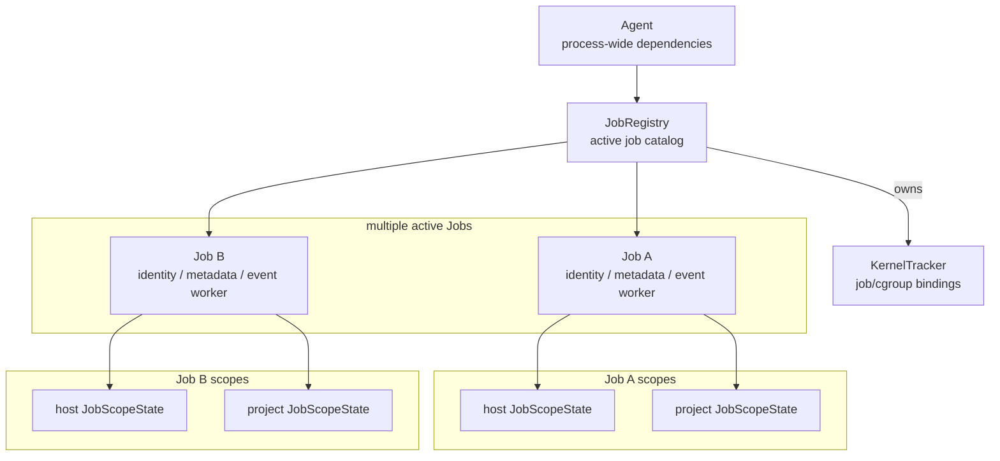

# Agent Ownership Boundaries

This page documents the Agent implementation ownership boundaries.
Read [Agent Architecture](agent.md) first for lifecycle, provider flow, and runtime entrypoints.

## Implementation types: Agent, JobRegistry, Job, JobScopeState

The Agent concepts are realised by four Go types whose relationship is fixed. Misplacing a field across this boundary breaks the security model, so the structure is load-bearing.

A single agent process holds one `Agent` and one `JobRegistry`.
The `JobRegistry` can hold many active `Job`s.
Each `Job` owns its own scope states: up to one host `JobScopeState` built by `ApplyGitHubHostStart` / `ApplyGitLabHostStart`, and up to one project `JobScopeState` built by `ApplyGitHubProjectStart`.

Scope state is therefore **per Job**, not shared across the registry.
Host and project scope states attached to a Job never read or write each other.
Rule actions, including `terminate`, only emit detections; the Job ends through external triggers (Runner termination, cgroup removal).

## Where each type holds state

### Agent

`Agent` is the **top-level process-wide orchestrator**.
It is the natural home for dependencies that exist once per agent process, such as the host manager connection and listener configuration.
It does not own host or project scope state; scope state is attached to each `Job`.

| Holds | Does not hold |
| --- | --- |
| <ul><li>`hostManagerConn`</li><li>`hostManagerClient`</li><li>`socketPath`</li><li>`provider` / `runnerType`</li><li>agent lifecycle state for shutdown and drain</li></ul> | <ul><li>per-scope state</li><li>active job map</li><li>kernel tracking state</li></ul> |

### JobRegistry

`JobRegistry` is the **active jobs catalog and KernelTracker binding**.
Host-start methods (`ApplyGitHubHostStart`, `ApplyGitLabHostStart`) receive the host manager connection / client as parameters; `JobRegistry` does not hold them as fields.

| Holds | Does not hold |
| --- | --- |
| <ul><li>`jobs` map: active Jobs by identity</li><li>KernelTracker binding</li><li>baseline loader</li><li>in-flight `starting` reservations</li></ul> | <ul><li>manager clients</li><li>per-scope `OutputSettings`</li><li>result log senders</li><li>manager output queues</li></ul> |

### Job

`Job` holds **one CI Job's identity, metadata, lifecycle, and event worker**.
It also points to up to two `JobScopeState`s: host and project.

| Holds | Does not hold |
| --- | --- |
| <ul><li>`JobIdentity`</li><li>`JobMetadata`</li><li>job lifecycle state</li><li>one event worker</li><li>host `JobScopeState`, if attached</li><li>project `JobScopeState`, if attached</li></ul> | <ul><li>per-scope config as direct Job fields</li><li>host / project output queues</li><li>KernelTracker ownership</li></ul> |

Per-scope config does not become a Job-level field: it lives on the referenced `JobScopeState`.

### JobScopeState

`JobScopeState` holds **per-scope state for one Job**.

| Holds | Does not hold |
| --- | --- |
| <ul><li>`Type`: host or project</li><li>`RuleSets`</li><li>`RuleModifiers`</li><li>`ConfigRevision`</li><li>`OutputSettings`</li><li>`ResolvedRules`</li><li>`Observations`</li><li>`DefaultMaxAlertsPerRule`</li><li>scope-local manager job-log routing</li></ul> | <ul><li>state that assumes host and project share it</li></ul> |

If host and project could diverge in the future, the value is scope-local from the start. Equal values today are not a reason to hoist. Shared queues, connection reuse, and similar optimizations come after ownership is clear.

## Naming and configuration flow

Names expose the owner: `host*` for host-owned, `project*` for project-owned, `scope*` (or placement on `JobScopeState`) for scope-local. A wide, owner-free name on a shared struct is the sign of a placement bug.

Configuration flows along the diagram's edges: host config from the host operator (`Agent` -> `JobRegistry` host-start -> the Job's host `JobScopeState`); project config from a project start request -> the Job's project `JobScopeState`. `FetchConfig` results stay within the scope of the client that issued the fetch. The host operator does not override project rules, caps, or output destinations; adversarial project input is bounded by a global hard ceiling.

## Event evaluation is per-Job

Host scope and project scope are separate rule sets, but they normally overlap heavily in practice: both sides typically include the same Baseline rules independently. Evaluating the same compiled rule twice (once per scope) would scale the CEL hot path with the number of scopes for no behavioural gain.

Rule evaluation is therefore done **per Job, not per scope**: `mergeEvaluationRules` de-duplicates rules across the Job's host and project `JobScopeState`s, `NewEvaluationState` compiles the merged set once, and each event is evaluated against that merged set in a single pass by the Job's one event worker. Per-rule `FeedHost` / `FeedProject` flags then route each hit back to the host `JobScopeState`, the project `JobScopeState`, or both. Scope isolation is preserved in the **output routing**, not by duplicating evaluation per scope.

For job lifecycle and tracking entrypoints, see [Agent Architecture](agent.md).
For kernel-side observation details, see [eBPF Runtime](ebpf-runtime.md).
