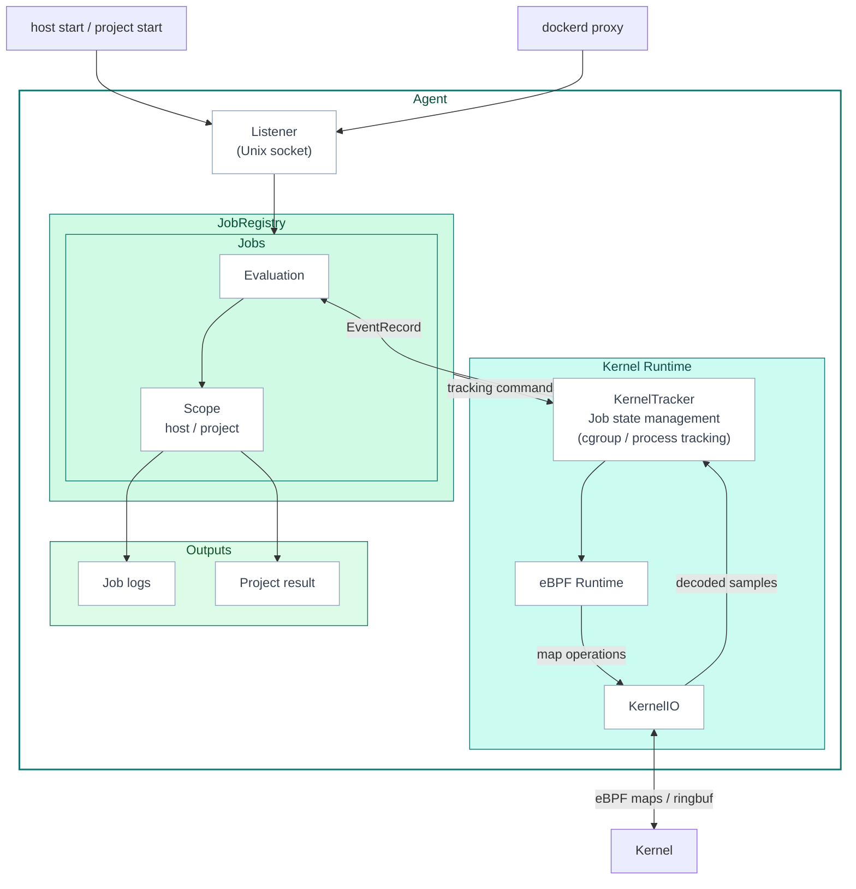

# Agent Architecture

The Agent is the central component that connects CI/CD job lifecycle with runtime events.

One agent process runs on one host and can observe multiple CI/CD jobs at the same time.
Kernel-side observation is handled with eBPF. Job lifecycle and rule evaluation are handled in userspace.

## Architecture

This diagram is the reference point for reading the Agent implementation.
`host start`, `project start`, and dockerd proxy staging requests enter the Agent through the Listener over a Unix socket.
JobRegistry issues tracking commands to the Kernel Runtime.
Scope owns rule, summary, and output state, but it does not operate the Kernel Runtime directly.

## Concepts

### Job

A **Job** is one CI/CD job tracked by the Agent. It is identified by the provider-supplied job identity (repository, workflow run, job name, runner) and owns its own cgroup tracking, rule evaluation, scope-local summaries, and outputs. The Agent can run many Jobs at the same time; each Job is finalized independently when its work completes.

The Agent separates job identity from job metadata.
Identity is required to register and track a Job.
Metadata is attached to the Job for logs, reports, and search.

| Category | Fields | Required | Purpose |
| --- | --- | --- | --- |
| Job identity | `provider`, `provider_host`, `project_path` | Yes | Common provider identity for every Job |
| GitHub identity | `github_run_id`, `github_job`, `github_run_attempt`, `github_runner_tracking_id` | Yes for GitHub Jobs | Identifies a GitHub Actions job run attempt and runner tracking ID |
| GitLab identity | `gitlab_job_id` | Yes for GitLab Jobs | Identifies a GitLab CI job execution |
| Job metadata | `commit_sha`, `ref_name`, `trigger`, `actor_id`, `actor_name`, `github_workflow_ref`, `github_workflow_sha`, `github_workflow`, `gitlab_job_name`, `gitlab_config_ref_uri` | No | Enriches logs, reports, and triage |

### Scope

A **Scope** is the configuration / control surface attached to a Job. Two kinds exist, and a single Job may have one or both:

| Scope | Owner | Where it comes from | Typical setup |
| --- | --- | --- | --- |
| **Host scope** | Host operator (e.g., the platform team that installs cicd-sensor on the runner host) | `host start` from a runner hook | Self-hosted runners, where the agent is provisioned by infrastructure |
| **Project scope** | Project / repository operator (e.g., the team owning the workflow) | `project start` from the cicd-sensor-action (or equivalent) | GitHub-hosted runners, where each workflow brings its own configuration through the Action |

Each scope carries its own rules, evaluation state, and output destinations. The two are isolated: one scope cannot read or override the other's rules, and their outputs are emitted separately. This lets the host operator and the repository operator each configure cicd-sensor for their own concerns without interfering with each other — the host operator can enforce a baseline across all jobs on the host, while a repository can layer project-specific rules on top.

## Subsystems

| Subsystem | Responsibility |
| --- | --- |
| Agent | Top-level orchestrator for Listener, JobRegistry, KernelTracker, and shutdown |
| Listener | Receives start / staging requests over the Unix socket and handles provider routes and peer credentials |
| JobRegistry | Handles job registration, host / project scope attachment, KernelTracker primitive composition, and finalize |
| Jobs / Scope | Handles per-job event workers, rule evaluation, and scope-local summaries / outputs |
| KernelTracker / eBPF Runtime | Handles cgroup / process tracking, kernel sample decoding, and EventRecord attribution |
| Outputs | Holds runtime summaries used as inputs for job logs, project results, reports, and attestations |

## Provider Flow

| Provider | Runner | Start entrypoint | cgroup seed |
| --- | --- | --- | --- |
| GitHub Actions | GitHub-hosted runner | `/v1/github/project/start` | cgroup of the project start peer PID |
| GitHub Actions | Self-hosted Machine Runner | `/v1/github/host/start` | cgroup of the hook peer PID |
| GitLab CI/CD | Self-hosted Docker executor | `/v1/gitlab/staging/put` -> lazy `/v1/gitlab/host/start` | Docker label evidence and staging promote |
| GitHub ARC / GitLab Kubernetes executor | Planned | TBD | NRI / Pod metadata and similar options are under consideration |

The agent process selects one provider at startup.
The Listener mounts either `/v1/github/*` or `/v1/gitlab/*`, not both.

## KernelTracker Primitives

Job tracking is expressed by JobRegistry composing KernelTracker primitives.

| Primitive | Meaning |
| --- | --- |
| `RegisterJob(jobID)` | Creates userspace job state and a per-job event channel. Does not touch BPF maps. |
| `BindProcessCgroupToJob(jobID, pid)` | Resolves the PID cgroup and adds it to `tracked_cgroups`. |
| `StageCgroupBasenameForJob(basename, jobID)` | Stages a Docker cgroup basename. |
| `RemoveJob(jobID)` | Cleans up job state, cgroup bindings, staging entries, and process context. |

`RegisterJob` and cgroup binding are separate operations.
GitHub can resolve the cgroup from the peer PID at start time, so it uses `RegisterJob + BindProcessCgroupToJob`.
GitLab Docker executor registers a job from label identity evidence and waits for a later staging promote.

## Design Notes

- Job membership is determined by cgroup tracking. Process context is a fat node snapshot with `exec_path` / `argv` / `ancestors`; it is not used as the job boundary.
- KernelTracker state is owned exclusively by its loop goroutine. `jobTrackingState` is not published externally.
- Listener stays as the delivery layer. Provider differences are contained in handlers and JobRegistry primitive composition.
- Output runtime is scope-local. Host / project output queues are not hoisted into JobRegistry.
- JobRegistry owns lifecycle. It is not on the hot path for event routing.

For kernel-side observation details, see [eBPF Runtime](ebpf-runtime.md).
For the rule authoring surface, see [Rules](../user-guide/rules.md). For the internal implementation, see [Rule Engine](rule-engine.md).
