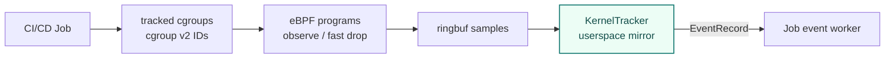

# eBPF Runtime

The eBPF Runtime is the layer that observes CI/CD job process, network, file access, and domain access at the kernel level. Kernel baseline is Linux `5.15+`.

## Why cgroup v2 tracking

When monitoring CI/CD runtime, deciding **how much of the OS to observe** is the core design tradeoff.

| Approach | Strength | Weakness |
| --- | --- | --- |
| Watch the whole host | Few blind spots | Noisy: runner host, system daemons, unrelated workloads — hard to interpret in CI/CD context |
| Watch only the job's processes by PID lineage | Quiet | Misses work that goes through a container runtime or a host-side helper process |
| **cgroup v2 membership (cicd-sensor)** | Quiet for normal CI/CD activity, while still catching container workloads through staging promote | Cannot follow work that escapes into another host-side process; those escape patterns are handled as runtime events instead |

cicd-sensor uses cgroup v2. Kernel hooks check whether the current cgroup is in `tracked_cgroups` and fast-drop unrelated events. The userspace KernelTracker keeps a `cgroup_id -> JobIdentity` mirror and decides which job receives each EventRecord.

Process context is attached to events as a **fat-node snapshot** (`exec_path`, `argv`, `ancestors`). It is not walked at evaluation time. The source of truth for job membership is cgroup tracking, not process context.

## Tracking model

| Pattern | Trigger | Role |
| --- | --- | --- |
| cgroup membership | `cgroup_mkdir`, `cgroup_attach_task`, `cgroup_rmdir` | Tracks job-related cgroups through inheritance, migration, and removal |
| staging promote | Docker proxy + `cgroup_mkdir` | If the caller of a Docker create request belongs to a tracked job, bind the later container cgroup to that job |
| process context enrichment | `sched_process_fork`, `sched_process_exec`, `sched_process_exit` | Creates a fat node snapshot with `exec_path`, `argv`, and `ancestors` for `EventRecord.Process` |

When a CI/CD job starts a container through the host-side Docker socket, the actual container process may enter a separate cgroup created by dockerd, not a descendant cgroup of the job process. In that case, cgroup membership alone cannot track the container as part of the job.

The Docker proxy checks the peer process of the Docker create request and determines whether that process belongs to a tracked job cgroup. If it does, the proxy stages the basename of the container cgroup that will be created and associates it with the job. Later, when the kernel-side `cgroup_mkdir` hook observes the actual container cgroup creation, that staging entry is promoted and the container cgroup is added to the job's tracked cgroups.

## Event coverage

The eBPF Runtime handles both rule-facing events and internal tracking samples.

| Area | Representative hooks | Rule-facing event |
| --- | --- | --- |
| process | `sched_process_exec` | `process_exec` |
| cgroup tracking | `cgroup_mkdir`, `cgroup_attach_task`, `cgroup_rmdir` | internal tracking sample |
| network | `cgroup/connect4`, `cgroup/connect6` | `network_connect` |
| file | `security_file_open`, `security_inode_unlink`, `security_inode_rename`, `security_inode_link` | `file_open`, `file_remove`, `file_move`, `file_link` |
| domain | `udp_sendmsg`, `udpv6_sendmsg`, `tcp_sendmsg` | `domain` |
| unix socket | `security_socket_connect` | `unix_socket_connect` |

`cgroup/connect4/6` is not attached per tracked cgroup. The agent attaches once to the cgroup v2 root detected at startup, and the program uses `tracked_cgroups` lookup to handle only target jobs.

## Kernel / userspace boundary

BPF map state is intentionally small. The kernel side only needs to answer two questions: whether the current cgroup should be observed, and whether a Docker cgroup basename has already been staged. Richer state such as JobIdentity and process context lives in the KernelTracker userspace mirror.

### BPF maps

| Map | Key | Role |
| --- | --- | --- |
| `tracked_cgroups` | cgroup ID | Lets BPF hooks decide on the fast path whether the current cgroup is in scope |
| `staging_map` | Docker cgroup basename | Lets the `cgroup_mkdir` hook detect cgroup creation staged by the Docker proxy |

`staging_map` does not contain JobIdentity. The kernel side only matches the basename; userspace mirror state knows which job it belongs to.

### KernelTracker userspace state

| State | Role |
| --- | --- |
| `jobByCgroup` | Maps cgroup ID to JobIdentity for attributing kernel samples to jobs |
| `cgroupsByJob` | Cleans up all cgroups belonging to a job when the job ends |
| `stagingByBasename` | Maps Docker cgroup basename to JobIdentity and promotes `staging_map` hits to jobs |
| `stagingByJob` | Cleans up staging entries for a job when the job ends |
| `processesByJob` / `processNode` | Holds process fat nodes and attaches `exec_path`, `argv`, and `ancestors` to EventRecord |

## Implementation layout

| Path | Content |
| --- | --- |
| `internal/agent/bpf` | Hand-written eBPF C source, headers, and bpf2go-generated bindings / objects |
| `internal/agent/kerneltracker` | KernelTracker reactor, decoded sample domain, cgroup / process tracking |
| `internal/agent/kerneltracker/kernelio` | BPF object load, attach, ringbuf read, and map operations |
| `internal/agent/proxy/dockerd` | Registers staging basenames from Docker API responses |

`internal/agent/bpf` owns the eBPF assets, and `internal/agent/kerneltracker` owns the userspace reactor. Generated artifacts (`bpf2go` output) are not edited by hand — fix the C source or generator input.
