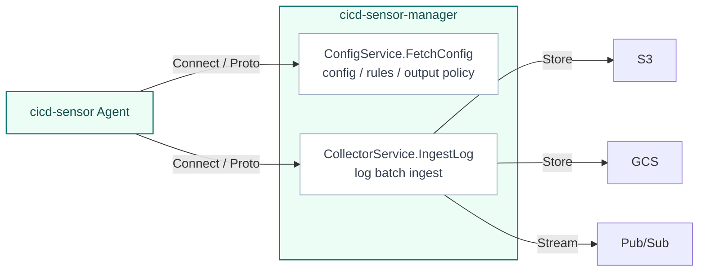

# Manager Architecture

The Manager is the server component that receives config fetch and log ingest requests from Agents.
Agent-to-manager communication uses the gRPC-based Connect protocol.
Request / response types are defined with Protocol Buffers, and the source of truth for the wire contract is `proto/cicd_sensor/manager/v1`.

Runtime event observation, rule merge, and rule evaluation are Agent responsibilities.
The Manager does not observe CI/CD runtime directly. It acts as the config / rule delivery and log delivery boundary.

## Protocol boundary

The Manager exposes two endpoints to Agents.

| Service | Method | Purpose |
| --- | --- | --- |
| `ConfigService` | `FetchConfig` | Agent fetches config, rule source, and output policy |
| `CollectorService` | `IngestLog` | Agent sends gzip-compressed JSONL log batches to the manager |

## Config and rule delivery

Agents fetch config and rules with `ConfigService.FetchConfig`.
In manager mode, repository-local `.cicd-sensor/config.yaml` and `.cicd-sensor/rules/` are not used.

Startup config is read once at process start.
Rules are checked on each `FetchConfig` request: if the rule bundle file's modification time or size has changed, it is re-parsed; otherwise the cached parse is reused.
Rule updates therefore take effect by replacing the file on disk, without restarting the Manager.

File paths can be specified by CLI flags or environment variables, but the config and rule contents themselves are not expanded into environment variables.

Rule sources returned by the Manager are merged and compiled by the Agent.
The Manager holds the rule bundle, but it does not evaluate runtime events.

## Log ingest and outputs

Agents send Job Result Logs, Detection Logs, and Runtime Telemetry Logs to `CollectorService.IngestLog` as gzip-compressed JSONL batches.
The Manager delivers them to sinks such as S3, GCS, or Pub/Sub according to the routing policy for each log kind.

The Manager treats the log batch as the delivery unit.
It does not interpret runtime events or evaluate detections.

Cloud credentials are held only by the Manager process.
Agents do not receive cloud credentials.

## Design rules

- Treat the Manager as a stateless config server and log router.
- Replicas with the same startup config, rule bundle, tokens, and cloud credentials can scale horizontally.
- Authentication validates the bearer token on each request.
- Token, startup config, and output routing reload by process restart. Rule bundle changes are picked up on the next `FetchConfig` request without a restart.
- TLS is not terminated inside the Manager process. Termination belongs to Ingress, load balancer, service mesh, or private network infrastructure.
