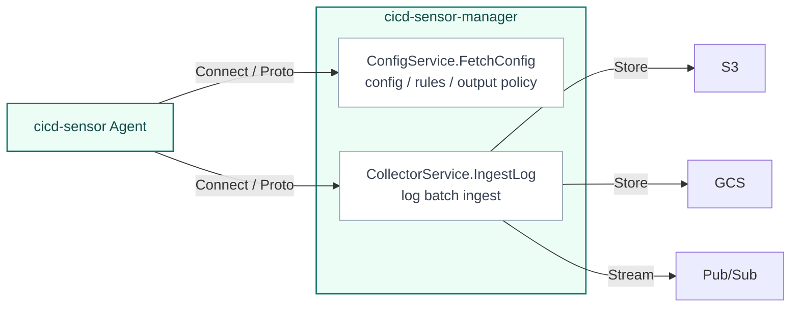

# Manager Architecture

The Manager is the optional server component that operators deploy when they want to run cicd-sensor across a runner fleet.
It centralizes config delivery, rule delivery, and log routing, so individual CI/CD jobs do not need to carry rule bundles or cloud output credentials.

The Manager is not a runtime sensor.
Agents still observe CI/CD runtime activity and evaluate rules locally in each job or host scope.
The Manager provides the operational boundary for distributing policy and receiving the resulting logs.

## Agent to Manager protocol

cicd-sensor uses the gRPC-based [Connect protocol](https://connectrpc.com/) with Protocol Buffers for Agent-to-Manager communication.
Connect keeps the typed protobuf contract while allowing the same services to run over HTTP/1.1 and HTTP/2.
This is the main reason cicd-sensor uses Connect rather than plain gRPC: plain gRPC generally assumes HTTP/2, while Connect can run through infrastructure that only supports HTTP/1.1.

HTTP/1.1 support makes the Manager easier to place behind load balancers that do not support HTTP/2 and easier to adapt to serverless environments such as AWS Lambda.
The wire schema is defined in [`proto/cicd_sensor/manager/v1`](https://github.com/cicd-sensor/cicd-sensor/tree/main/proto/cicd_sensor/manager/v1).

The Manager exposes two endpoints to Agents.

| Service | Method | Purpose |
| --- | --- | --- |
| `ConfigService` | `FetchConfig` | Agent fetches config, rule source, and output policy |
| `CollectorService` | `IngestLog` | Agent sends gzip-compressed JSONL log batches to the manager |

## Config and rule delivery

Agents fetch config and rules with `ConfigService.FetchConfig`.
In manager mode, repository-local `.cicd-sensor/config.yaml` and `.cicd-sensor/rules/` are not used.

Startup config is read once at process start.
Rules are checked on each `FetchConfig` request: if the rule bundle file's modification time or size has changed, it is re-parsed; otherwise the cached parse is reused.
Rule updates therefore take effect by replacing the file on disk, without restarting the Manager.

The Manager process accepts file locations through either CLI flags or environment variables.

| Input | CLI flag | Environment variable | Reload behavior |
| --- | --- | --- | --- |
| Startup config | `--config-file` | `CICD_SENSOR_MANAGER_CONFIG_FILE` | Read at process start |
| Rule bundle | `--rules-file` | `CICD_SENSOR_MANAGER_RULES_FILE` | Rechecked on each `FetchConfig` request |

Only file locations are part of this startup interface.

Rule sources returned by the Manager are merged and compiled by the Agent.
The Manager holds the rule bundle, but it does not evaluate runtime events.

## Log ingest and outputs

Agents send Summary Logs, Detection Logs, and Runtime Event Logs to `CollectorService.IngestLog` as gzip-compressed JSONL batches.
The Manager delivers them to sinks such as S3, GCS, or Pub/Sub according to the routing policy for each log type.

The Manager treats the log batch as the delivery unit.
It does not interpret runtime events or evaluate detections.

Cloud credentials are held only by the Manager process.
Agents do not receive cloud credentials.

## Design rules

- Treat the Manager as a stateless config server and log router.
- Replicas with the same startup config, rule bundle, tokens, and cloud credentials can scale horizontally.
- Authentication validates the bearer token on each request.
- Token, startup config, and output routing reload by process restart. Rule bundle changes are picked up on the next `FetchConfig` request without a restart.
- TLS is not terminated inside the Manager process. Termination belongs to Ingress, load balancer, service mesh, or private network infrastructure.
