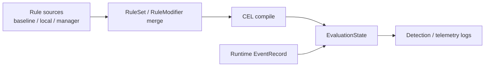

# Rule Engine

The Rule Engine loads RuleSets and RuleModifiers, compiles CEL conditions, and evaluates runtime events.

The User Guide [Rules](../user-guide/rules.md) page is the rule authoring surface.
This page explains how that surface maps to the implementation.

## Flow

## Responsibilities

| Area | Responsibility |
| --- | --- |
| Schema | YAML schema validation for RuleSet / RuleModifier |
| Merge | Merge baseline, local, and manager rule sources with modifiers |
| CEL | Build activations per event kind and compile conditions / correlations |
| Evaluation | Evaluate runtime events against rules and apply actions / tags / max alerts |
| Correlation | Multi-signal detection with `rule.<rule_id>.total_count` |

## CEL boundary

The CEL environment exposes only the surface needed for rule authoring.
Regex, index access, arithmetic, and similar features are not allowed.
This keeps detection rules readable and runtime evaluation predictable.

The source of truth for event-kind fields is the User Guide [Event kinds](../user-guide/rule-event-kinds.md) and [CEL conditions](../user-guide/rule-cel-conditions.md) pages.
