# GitHub Actions Runner Controller (ARC)

For GitHub Actions jobs running under [Actions Runner Controller](https://github.com/actions/actions-runner-controller) (`gha-runner-scale-set`) on Kubernetes, install the cicd-sensor Agent as a DaemonSet on each runner node and operate it with cicd-sensor Manager.

Manager is required.
Config, rules, and log delivery are handled through the manager, the same way as the [GitHub Actions self-hosted](github-self-hosted.md) deployment.
This page covers the ARC-specific deployment shape on Kubernetes.

## Overview

```mermaid
flowchart LR
    ARC["ARC<br/>gha-runner-scale-set"]
    POD["Runner Pod<br/>(EphemeralRunner)"]
    HOOKS["Job hooks<br/>started / completed"]
    AGENT["cicd-sensor Agent<br/>(DaemonSet)"]
    MANAGER["cicd-sensor-manager"]
    CLOUD["Cloud Outputs / SIEM"]

    ARC --> POD --> HOOKS
    HOOKS -->|"host start / host end"| AGENT
    MANAGER -->|"Config / Rules"| AGENT
    AGENT -->|"Summary / Detection / Runtime Event Logs"| MANAGER
    MANAGER --> CLOUD

    classDef cicdSensor fill:#ecfdf5,stroke:#0f766e,color:#134e4a,stroke-width:1.5px;
    class AGENT,MANAGER cicdSensor
```



On ARC, cicd-sensor creates one job record for each GitHub Actions job.
The Agent runs as a DaemonSet on each worker node and observes runner pods scheduled to that node.

Running the Agent only inside the runner pod is not a supported target.
The eBPF observation surface needs node-level access, so the DaemonSet placement is required.

## Supported configurations

| Setting | Required value | Note |
| --- | --- | --- |
| ARC chart | `gha-runner-scale-set` 0.13 or later | Legacy ARC (`RunnerDeployment`, `AutoscalingRunnerSet` v1) is not supported. |
| `containerMode.type` | `dind` | `kubernetes` mode is on the roadmap; track [platform support](overview.md#platform-support). |
| Node kernel | 5.15 or later on `amd64`, 6.1 or later on `arm64` | Same baseline as the Self-hosted Machine Runner. |
| Cgroup hierarchy | cgroup v2 unified | Kubernetes 1.25 or later, with the `systemd` kubelet cgroup driver. |
| Runner image | `ghcr.io/actions/actions-runner` or a derivative that honors `ACTIONS_RUNNER_HOOK_JOB_STARTED` | The hook env vars are part of the actions/runner contract; a forked runner image must keep them. |

## Per-scale-set isolation

A single cicd-sensor Agent on a node observes every runner pod scheduled to that node, regardless of which `AutoscalingRunnerSet` resource the pod belongs to.
Each scale set still gets its own rules and output destinations.
The Agent reads two labels that the ARC controller writes onto every runner pod:

| Label | Set by | Used as |
| --- | --- | --- |
| `actions.github.com/scale-set-namespace` | ARC controller | Scale-set identity (namespace component) |
| `actions.github.com/scale-set-name` | ARC controller | Scale-set identity (name component) |

The Agent treats the `(namespace, name)` pair as the scale-set key and routes each job to the matching host scope configuration in the manager.
The runner pod cannot forge these labels; they are written by the ARC controller through the Kubernetes API.

Configure per-scale-set overrides in the manager's startup config under `arc_scale_sets`:

```yaml
default_max_alerts_per_rule: 5
monitor_mode: false

arc_scale_sets:
  - namespace: arc-prod
    name: prod-deploy
    default_max_alerts_per_rule: 20
    rules_file: /etc/cicd-sensor/rules/prod.yaml
  - namespace: arc-ci
    name: ci-tests
    monitor_mode: true
    rules_file: /etc/cicd-sensor/rules/ci.yaml
```

Each entry overrides one or more of `default_max_alerts_per_rule`, `disable_baseline_rules`, `monitor_mode`, and `rules_file`.
Fields left unset inherit the global values.
A `FetchConfig` request from a runner pod whose scale-set labels match an entry's `(namespace, name)` receives the override's resolved configuration.
A request that does not match any entry (non-ARC runners and unconfigured scale sets) receives the global defaults.
Editing this file and reloading the manager does not restart any runner pod.

## Install the Agent

Apply the manifests from `deploy/arc/` in this repository.

```sh
kubectl create namespace cicd-sensor
kubectl apply -n cicd-sensor -f deploy/arc/rbac.yaml
kubectl apply -n cicd-sensor -f deploy/arc/daemonset.yaml
```

The DaemonSet runs one Agent pod on every worker node and exposes the control socket at `/var/run/cicd-sensor/control.sock` on the host filesystem.
An `install-cli` initContainer copies the Agent CLI to `/opt/cicd-sensor/cicd-sensor` so runner pods can mount and call it.

The Agent is launched with `--provider=github-arc --runner=kubernetes` and reads two ARC-specific flags:

| Flag | Purpose |
| --- | --- |
| `--manager-url` | URL of the reachable cicd-sensor-manager. Same flag the Self-hosted Machine Runner agent uses. |
| `--arc-namespaces` | Comma-separated list of Kubernetes namespaces hosting `AutoscalingRunnerSet` resources whose runner pods this Agent should classify by scale-set identity. The Agent watches these namespaces through the Kubernetes API to read pod labels. |

The DaemonSet manifest in `deploy/arc/daemonset.yaml` shows the placement; substitute your manager URL, secret name, and ARC namespaces before applying.

## Wire each runner scale set

Apply the hook ConfigMap to every namespace that hosts an `AutoscalingRunnerSet`:

```sh
kubectl apply -n <arc-namespace> -f deploy/arc/configmap-hooks.yaml
```

Then add the values overlay in `deploy/arc/values-overlay.yaml` to the `gha-runner-scale-set` Helm release for that scale set:

```sh
helm upgrade --install <release> \
  oci://ghcr.io/actions/actions-runner-controller-charts/gha-runner-scale-set \
  -n <arc-namespace> \
  -f my-values.yaml \
  -f deploy/arc/values-overlay.yaml
```

The overlay does three things:

| Block | Purpose |
| --- | --- |
| `template.spec.volumes` | Mounts the Agent control socket, the Agent CLI binary, and the hook ConfigMap into the runner pod. |
| `template.spec.containers[runner].volumeMounts` | Places those volumes on paths the hook scripts expect. |
| `template.spec.containers[runner].env` | Points `ACTIONS_RUNNER_HOOK_JOB_STARTED` and `ACTIONS_RUNNER_HOOK_JOB_COMPLETED` at the mounted hook scripts. |

The overlay contains plumbing only.
Changes to rules, output destinations, or detection toggles are delivered through the manager and do not require a Helm upgrade.

This separation matters: editing the values overlay re-applies the `AutoscalingRunnerSet` template, which causes ARC to recreate the `EphemeralRunnerSet`, listener pod, and any pending runner pods.
Routing operational changes through the manager keeps in-flight jobs from being interrupted.

## Verify hooks

After the overlay is applied, run a test workflow on the scale set and inspect the cicd-sensor agent log on the node where the runner pod landed.

```sh
kubectl logs -n cicd-sensor -l app=cicd-sensor-agent --tail=100
```

A successful start hook produces a `host_start_accepted` log entry with the GitHub job identity fields.
The completed hook produces `host_end_accepted`.

The start hook is required to begin monitoring, so failures should fail the job.
The completed hook runs job health check and finalize inside `host end`.

## Action support

Even when the host-side setup is installed on the cluster, projects can still start cicd-sensor from `cicd-sensor-action`.
The action attaches a project scope to the same Job and runs alongside the host scope without conflict.
