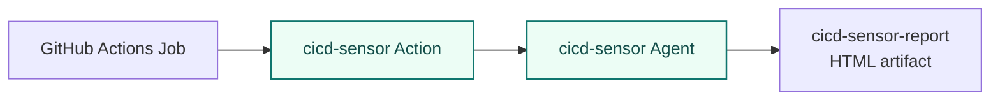
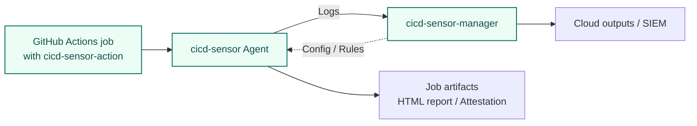

# GitHub-hosted runner

On GitHub-hosted runners, add `cicd-sensor/cicd-sensor-action` to the workflow to start monitoring.

With the default settings, the cicd-sensor action starts the agent before your workload, records job runtime activity, and uploads the HTML report and runtime-trace attestation predicate as artifacts after the job.
Optional inputs can enable centralized configuration through cicd-sensor Manager, cloud delivery for Job Result Log / Detection Log / Runtime Telemetry Log, and debug bundle uploads that include Runtime Telemetry Log output.

## Usage

```yaml
jobs:
  build:
    runs-on: ubuntu-24.04
    steps:
      - uses: cicd-sensor/cicd-sensor-action@0a8e3cadda4a9bb894eabd1a1960308cc7a5a5aa # v0.0.17
```

This action targets Linux GitHub-hosted VM runners.
You can use x64 and arm64 runner labels.

Examples:

- `ubuntu-latest`
- `ubuntu-24.04`
- `ubuntu-22.04`
- `ubuntu-24.04-arm`
- `ubuntu-22.04-arm`

The supported kernel ranges differ by architecture: 5.15 or later on `amd64`, 6.1 or later on `arm64`. The arm64 lower bound comes from upstream Linux because BPF trampoline / fentry attach was added on arm64 only in 6.0+.

`ubuntu-slim` is not supported.
It runs as a container on a shared VM and does not provide the host eBPF environment that cicd-sensor needs.

## Standalone mode

When no manager is configured, the agent starts inside the GitHub Actions job and uploads the HTML report as a job artifact.



The attestation artifact is generated by default.
Signing is not done by the action itself; use a downstream step or job, such as `actions/attest`, when you want to sign it.

## Config and Rules

In standalone mode, project-local config and custom rules live under `.cicd-sensor/`.

```text
repo/
  .cicd-sensor/
    config.yaml
    rules/
      a.yaml
      b.yaml
```

Even when project-local rules are not present, [Baseline Rules](baseline-rules.md) still apply.
Use project-local files only for repository-specific tuning or additional detections.

### config.yaml

`config.yaml` controls project-local defaults for the GitHub-hosted standalone mode.

```yaml
default_max_alerts_per_rule: 20
```

| Field | Meaning |
| --- | --- |
| `default_max_alerts_per_rule` | Default Detection Log limit for rules that do not set `max_alerts`. Allowed values are 1-100. |

See [RuleSet max_alerts](rule-set.md#max_alerts) for per-rule limits.

### rules/

Place one or more YAML files under `.cicd-sensor/rules/`.
For example:

```yaml
rule_sets:
  - ruleset_id: acme/github-hosted
    rules:
      - rule_id: curl_exec
        rule_name: "curl executed"
        event_kind: process_exec
        condition: process.exec_path.endsWith("/curl")
        action: detect
```

This emits a Detection Log entry when `curl` is executed during the job.
See [RuleSet](rule-set.md), [Event kinds](rule-event-kinds.md), [CEL conditions](rule-cel-conditions.md), [Correlation](rule-correlation.md), and [Rule modifiers](rule-modifiers.md) for the full rule syntax.

The action can be placed as the first step so it can monitor the whole job.
It is fine to place it before `actions/checkout`.

Rules can be validated before running the workflow.

```sh
cicd-sensorctl rule validate .cicd-sensor/rules
```

## Manager delivery

Use cicd-sensor Manager when you want to send Job Result Logs, Detection Logs, and Runtime Telemetry Logs from GitHub-hosted runners to cloud-side outputs.
In this mode, the cicd-sensor Agent can still generate the HTML report and attestation artifact as job artifacts.

Important: when `manager-url` is set, repository-local `.cicd-sensor/config.yaml` and `.cicd-sensor/rules/` are not used.
Config and rules are fetched from the manager.
Repository-local rules and manager rules are not merged together.

```yaml
jobs:
  build:
    runs-on: ubuntu-24.04
    steps:
      - uses: cicd-sensor/cicd-sensor-action@0a8e3cadda4a9bb894eabd1a1960308cc7a5a5aa # v0.0.17
        with:
          manager-url: https://cicd-sensor-manager.example.com
          manager-token: ${{ secrets.CICD_SENSOR_MANAGER_TOKEN }}
```



Store the manager token as a GitHub Actions secret.
Do not write secrets or tokens into repository config files.

## Action reference

For detailed inputs and outputs, see [cicd-sensor/cicd-sensor-action](https://github.com/cicd-sensor/cicd-sensor-action).
