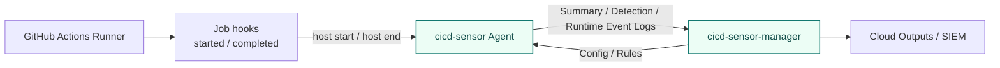

# GitHub Actions self-hosted

For GitHub Actions Self-hosted Machine Runners, install the cicd-sensor Agent and Docker proxy on the runner host and operate them with cicd-sensor Manager.

Complete [Self-hosted Machine install](self-hosted-install.md) first.
This page only covers the GitHub Actions-specific job lifecycle hooks.

## Overview



On Self-hosted Machine Runners, cicd-sensor creates one job record for each GitHub Actions job.
Whether the runner is ephemeral or long-lived, the Agent monitors runtime behavior per job.

Running only a long-lived Agent on a Self-hosted Machine Runner without a manager is not a supported target.
Config, rules, and log delivery are handled through the manager.

## Hook placement

GitHub Actions Self-hosted Machine Runners use GitHub job management hooks to start and end the cicd-sensor job lifecycle.
See GitHub's [Running scripts before or after a job](https://docs.github.com/en/enterprise-cloud@latest/actions/how-tos/manage-runners/self-hosted-runners/run-scripts) documentation.

The GitHub Actions runner executes scripts before and after each job when these environment variables point to absolute script paths.

| Hook | When it runs | cicd-sensor usage |
| --- | --- | --- |
| `ACTIONS_RUNNER_HOOK_JOB_STARTED` | After the job is assigned to the runner and before workflow steps start | Starts job monitoring with `cicd-sensor host start` |
| `ACTIONS_RUNNER_HOOK_JOB_COMPLETED` | After all workflow steps finish and before the job completes | Finalizes the job with `cicd-sensor host end` |

By GitHub's design, hook scripts run synchronously as the runner service user.
If the start hook exits non-zero, the job is not executed and fails.

## Hook scripts

Place the hook scripts under `/opt/cicd-sensor`.
This path matches the [Self-hosted Machine install](self-hosted-install.md) assumptions.

Start hook:

```sh
sudo sh -c 'printf "%s\n" "#!/usr/bin/env sh" "/opt/cicd-sensor/cicd-sensor host start" > /opt/cicd-sensor/github-job-started.sh && chmod 0755 /opt/cicd-sensor/github-job-started.sh'
```

Completed hook:

```sh
sudo sh -c 'printf "%s\n" "#!/usr/bin/env sh" "/opt/cicd-sensor/cicd-sensor host end" > /opt/cicd-sensor/github-job-completed.sh && chmod 0755 /opt/cicd-sensor/github-job-completed.sh'
```

`host start` and `host end` use the `GITHUB_*` and `RUNNER_TRACKING_ID` environment variables set by the GitHub Actions runner.
The hook scripts do not need to pass repository, run ID, job name, or similar identity fields explicitly.

## Configure the runner

GitHub documents two ways to configure hooks: OS environment variables or the `.env` file in the Self-hosted Machine Runner application directory.
This guide uses the runner directory `.env` so the setting is scoped per runner.

For example, if the runner is installed under `/opt/actions-runner`:

```sh
cd /opt/actions-runner
cat >> .env <<'EOF'
ACTIONS_RUNNER_HOOK_JOB_STARTED=/opt/cicd-sensor/github-job-started.sh
ACTIONS_RUNNER_HOOK_JOB_COMPLETED=/opt/cicd-sensor/github-job-completed.sh
EOF
```

Restart the runner service after changing `.env`.
GitHub's Linux runner service can be managed with the generated `svc.sh` in the runner directory.

```sh
sudo ./svc.sh stop
sudo ./svc.sh start
```

When multiple runners share the same host, set the same hook paths in each runner directory's `.env`.

## Verify hooks

After restarting the runner service, run a test workflow and inspect the GitHub Actions logs.
GitHub documents hook output under the `Set up runner` or `Complete runner` log sections.

On the runner host, inspect the cicd-sensor agent log.

```sh
sudo journalctl -u cicd-sensor-agent.service -f
```

The start hook is required to begin monitoring, so failures should fail the job.
The completed hook runs job health check and finalize inside `host end`.

## Action support

Even when host-side setup is installed manually on a Self-hosted Machine Runner, projects can still start cicd-sensor from `cicd-sensor-action`.
