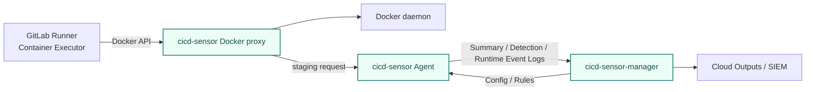

# GitLab CI/CD self-hosted

For GitLab CI/CD, the primary supported target is a self-hosted GitLab Runner using the Container Executor.

Complete [Self-hosted Machine install](self-hosted-install.md) first.
Unlike GitHub Actions, GitLab CI/CD does not require workflow steps or project-side job hooks. The runner host-side Agent and Docker proxy monitor the job runtime.

## Support status

| Environment | Status |
| --- | --- |
| Self-hosted Container Executor | Supported target |
| Self-hosted Kubernetes Executor | Planned |
| Self-hosted Shell Executor | Not planned |
| GitLab-hosted runner | Not supported due to technical constraints |

GitLab-hosted runners are not supported today because cicd-sensor cannot install the Agent on the runner host.

## Deployment model

GitLab Runner continues to run jobs with the Container Executor.
cicd-sensor observes Docker container creation on the runner host, associates the job runtime with the Agent, and sends logs to the manager.

## Install notes

In the [Self-hosted Machine install](self-hosted-install.md) systemd units, use these options for GitLab CI/CD.

| Component | Option |
| --- | --- |
| Agent | `--provider gitlab --runner machine` |
| Docker proxy | `--provider gitlab` |

In the supported GitLab CI/CD configuration, config and rules are fetched from the manager.
Using repository-local `.cicd-sensor/config.yaml` and `.cicd-sensor/rules/` is not a supported target.

## Manager

For GitLab CI/CD, the runner host sends these logs to the manager.

- Summary Log.
- Detection Log.
- Runtime Event Log.

See [Manager](manager.md) for details.
