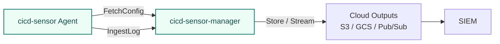

# Manager

cicd-sensor-manager is the component for operating cicd-sensor across multiple runners and projects.

The manager is the central point for config delivery, rule delivery, log ingest, and output routing.
Agent-to-manager communication is carried over HTTP/1.1 or HTTP/2.



## When to use it

The Manager is the only path that ships logs off the runner and the single point of central, real-time fleet management.

- **Required** for machine runner and Kubernetes runner deployments. Config, rules, and log delivery all go through the Manager.
- **Required** to ship Summary, Detection, or Runtime Event Logs anywhere — including from GitHub-hosted runners — and to distribute organization-wide rules from a central source.
- **Optional** only in GitHub-hosted runner standalone mode, which produces report and attestation artifacts in the job itself with repository-local config.

## Deployment model

cicd-sensor-manager is a stateless config server and log router.
It does not require a persistent database or local queue. Replicas with the same config, rule bundle, tokens, and cloud credentials can be scaled horizontally.

For production, prefer running the manager as a container or serverless workload on cloud services instead of manually placing it on a VM.
This keeps it stateless, easy to scale, and close to the cloud-side outputs it writes to.

| Target | Notes |
| --- | --- |
| AWS Lambda | Use the provided Lambda container image. AWS only pulls from its own container registry (ECR), so mirror the `ghcr.io` image to ECR or push the image there directly. |
| ECS / Fargate | Uses the standard manager container image. AWS only pulls from its own container registry (ECR), so mirror the `ghcr.io` image to ECR or push the image there directly. Pass config / rules / tokens through file mounts, secrets, or environment variables. |
| Kubernetes | Uses the standard manager container image. Run it as a Deployment with Service / Ingress. Pass config / rules through ConfigMap, Secret, or mounted volume. |
| Cloud Run | Uses the standard manager container image. Use service accounts / Workload Identity for GCS and Pub/Sub integration. Cloud Run only pulls from Google's container registry (Artifact Registry), so mirror the `ghcr.io` image to Artifact Registry or push the image there directly. |

Public container images are distributed through GitHub Packages.

| Image | Purpose |
| --- | --- |
| `ghcr.io/cicd-sensor/cicd-sensor-manager` | Standard deployment for ECS, Kubernetes, Cloud Run, and similar targets |
| `ghcr.io/cicd-sensor/cicd-sensor-manager-lambda` | Deployment with the AWS Lambda adapter |

See [cicd-sensor GitHub Packages](https://github.com/orgs/cicd-sensor/packages?repo_name=cicd-sensor) for the package list.

The manager does not terminate TLS directly.
Design HTTPS / TLS, authentication boundaries, and private network exposure with cloud-side components such as a load balancer, ingress, API Gateway, service mesh, or private network.

## Network requirements

Allow outbound HTTPS from the manager to the following hosts when baseline rules are enabled.

| Host | Purpose |
| --- | --- |
| `ghcr.io` | Fetch baseline rule bundles |
| `quay.io` | Fetch baseline rule bundles |
| `registry.gitlab.com` | Fetch baseline rule bundles |
| `tuf-repo-cdn.sigstore.dev` | Fetch the Sigstore root certificates used for baseline rule signature verification |

When using Manager, Agents do not connect to these hosts directly.
Agents connect to the Manager, and the Manager fetches and verifies baseline rules unless `disable_baseline_rules` is set.

## Startup files

The manager reads a startup config file and an optional rule bundle file.
Their file locations can be specified by flags or environment variables.

| File | Flag | Environment variable | Required |
| --- | --- | --- | --- |
| manager config | `--config-file /etc/cicd-sensor/manager.yaml` | `CICD_SENSOR_MANAGER_CONFIG_FILE=/etc/cicd-sensor/manager.yaml` | yes |
| rule bundle | `--rules-file /etc/cicd-sensor/rules.yaml` | `CICD_SENSOR_MANAGER_RULES_FILE=/etc/cicd-sensor/rules.yaml` | no |

When both a flag and an environment variable are set, the flag wins.
If neither `--rules-file` nor `CICD_SENSOR_MANAGER_RULES_FILE` is set, the manager starts without a custom rule bundle.

```sh
export CICD_SENSOR_MANAGER_CONFIG_FILE=/etc/cicd-sensor/manager.yaml
export CICD_SENSOR_MANAGER_RULES_FILE=/etc/cicd-sensor/rules.yaml
export CICD_SENSOR_MANAGER_TOKEN=sk_cs_...

cicd-sensor-manager
```

## Manager token

Manager authentication uses bearer tokens.
Do not write tokens into the config file; pass them through environment variables or token files.

Generate a token with `cicd-sensorctl`.

```sh
cicd-sensorctl token generate
```

Manager side:

```sh
export CICD_SENSOR_MANAGER_TOKEN=sk_cs_...
cicd-sensor-manager \
  --config-file /etc/cicd-sensor/manager.yaml \
  --rules-file /etc/cicd-sensor/rules.yaml
```

Agent side:

```sh
export CICD_SENSOR_MANAGER_TOKEN=sk_cs_...
cicd-sensor agent start \
  --provider github \
  --runner machine \
  --manager-url https://cicd-sensor-manager.example.com
```

For rotation, the manager can accept up to two tokens.
With environment variables, use `CICD_SENSOR_MANAGER_TOKEN` and `CICD_SENSOR_MANAGER_TOKEN_2`.
With token files, specify `--manager-token-file` up to two times.

## manager.yaml

Minimal config that actually persists logs. Defines one S3 sink and routes
all three log types to it:

```yaml
bind:
  address: "0.0.0.0"
  port: 8080

default_max_alerts_per_rule: 10
disable_baseline_rules: false
monitor_mode: false

sinks:
  s3-out:
    type: aws_s3
    uri: s3://cicd-sensor-prod/cicd-sensor/
    region: ap-northeast-1

logs:
  summary:
    sink: s3-out
  detection:
    sink: s3-out
  runtime_event:
    sink: s3-out
```

The manager reads `manager.yaml` once at process start. Changing these
settings requires a manager restart.

For richer routing (per-log-kind destinations, multiple sinks), see
[Log routing](#log-routing).

| Setting | Purpose | Default | Reload behavior |
| --- | --- | --- | --- |
| `bind` | Manager listen address and port. `bind.port` must be in 0-65535. | `address: "0.0.0.0"`, `port: 8080` | Manager restart |
| `default_max_alerts_per_rule` | Default per-rule Detection Log limit for rules that do not set `max_alerts`. Use 1-100 to set a value; omit it or set 0 to use the system default. | `10` | Manager restart |
| `disable_baseline_rules` | Disable cicd-sensor baseline rule fetch/prepend when using the manager. Custom rule bundles from `--rules-file` are still served. | `false` | Manager restart |
| `monitor_mode` | Treat `terminate` rules as `detect` rules. Use this for first rollout or collection-only operation without job stopping. | `false` | Manager restart |
| `sinks` | Physical cloud output destinations, such as S3, GCS, or Pub/Sub. | none | Manager restart |
| `logs` | Mapping from each manager-ingested `log_type` to one configured sink. | none | Manager restart |

The custom rule bundle is configured separately with `--rules-file` or
`CICD_SENSOR_MANAGER_RULES_FILE`. The manager rechecks that file on each
`FetchConfig` request, so rule bundle changes do not require a restart.

## Log routing

When logs are aggregated through the manager, define `sinks` and `logs`.
`sinks` define physical destinations, and `logs` maps each log type to one sink.

```yaml
sinks:
  gcs-summary:
    type: google_storage
    uri: gs://cicd-sensor-prod/cicd-sensor/

  pubsub-detection:
    type: google_pubsub
    project_id: security-prod
    topic: cicd-sensor-detection

  pubsub-runtime-event:
    type: google_pubsub
    project_id: security-prod
    topic: cicd-sensor-runtime-event

logs:
  summary:
    sink: gcs-summary
  detection:
    sink: pubsub-detection
  runtime_event:
    sink: pubsub-runtime-event
```

Supported log types:

| Log type | Purpose |
| --- | --- |
| `summary` | Job summary generated at finalize time |
| `detection` | Detection stream for rule hits |
| `runtime_event` | Runtime events for incident response and forensics |

Each log type takes one `sink`.
Use this mapping to choose patterns such as storing all logs in one GCS destination, streaming only Detection Logs to Pub/Sub, or retaining Runtime Event Logs in object storage.

### Sink settings

| Sink type | Required settings | Optional settings | Notes |
| --- | --- | --- | --- |
| `aws_s3` | `uri`, `region` | `use_path_style` | `uri` is an `s3://...` object-storage URI. Include any desired object key path in the URI. Set `use_path_style: true` to use path-style addressing (`endpoint/bucket`) instead of virtual-hosted-style (`bucket.endpoint`). |
| `google_storage` | `uri` | | `uri` is a `gs://...` object-storage URI. Include any desired object key path in the URI. |
| `google_pubsub` | `project_id`, `topic` | | Publishes one plain JSON record per message. |

Store logs in GCS:

```yaml
sinks:
  gcs-prod:
    type: google_storage
    uri: gs://cicd-sensor-prod/cicd-sensor/

logs:
  summary:
    sink: gcs-prod
  detection:
    sink: gcs-prod
  runtime_event:
    sink: gcs-prod
```

Send logs to Pub/Sub:

```yaml
sinks:
  pubsub-detection:
    type: google_pubsub
    project_id: security-prod
    topic: cicd-sensor-detection

  pubsub-runtime-event:
    type: google_pubsub
    project_id: security-prod
    topic: cicd-sensor-runtime-event

logs:
  detection:
    sink: pubsub-detection
  runtime_event:
    sink: pubsub-runtime-event
```

### Sink authentication

The manager authenticates to each cloud sink using the cloud SDK's standard credential discovery. Configure credentials via the runtime environment — do not write any credentials into `manager.yaml`. Cloud credentials are held only by the manager process; the Agent does not receive them.

#### Google Cloud (GCS, Pub/Sub)

The manager uses [Application Default Credentials](https://cloud.google.com/docs/authentication/application-default-credentials).
On GKE / GCE, grant access with Workload Identity or an attached service account. In other environments, use the standard runtime mechanism such as `GOOGLE_APPLICATION_CREDENTIALS`.

#### AWS (S3)

The manager uses the [AWS default credentials provider chain](https://docs.aws.amazon.com/sdkref/latest/guide/standardized-credentials.html).
On EKS / ECS / EC2, grant access with an IAM role attached to the workload (EKS Pod Identity / IRSA, ECS task role, or EC2 instance profile). In other environments, use the standard runtime mechanism such as `AWS_ACCESS_KEY_ID` / `AWS_SECRET_ACCESS_KEY` environment variables or the shared credentials file (`~/.aws/credentials`).
