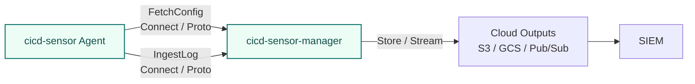

# Manager

cicd-sensor-manager is the component for operating cicd-sensor across multiple runners and projects.

The manager is the central point for config delivery, rule delivery, log ingest, and output routing.
Agent-to-manager communication uses the gRPC-based Connect protocol, and request / response types are defined with Protocol Buffers.



## When to use it

Use the manager for operations such as:

- Running a Self-hosted Machine Runner fleet.
- Distributing organization-wide standard rules or custom rules.
- Aggregating Detection Logs and Runtime Telemetry Logs into a SIEM or data lake.
- Keeping per-job evidence centrally for incident response.
- Avoiding cloud credentials on runner hosts.

For a first test in a single project, start with standalone GitHub-hosted runner usage.

## Deployment model

cicd-sensor-manager is a stateless config server and log router.
It does not require a persistent database or local queue. Replicas with the same config, rule bundle, tokens, and cloud credentials can be scaled horizontally.

For production, prefer running the manager as a container or serverless workload on cloud services instead of manually placing it on a VM.
This keeps it stateless, easy to scale, and close to the cloud-side outputs it writes to.

| Target | Notes |
| --- | --- |
| AWS Lambda | Uses a Lambda adapter image. A Lambda image that includes `public.ecr.aws/awsguru/aws-lambda-adapter` is provided. AWS only pulls from its own container registry (ECR), so mirror the `ghcr.io` image to ECR or push the image there directly. |
| ECS / Fargate | Uses the standard manager container image. AWS only pulls from its own container registry (ECR), so mirror the `ghcr.io` image to ECR or push the image there directly. Pass config / rules / tokens through file mounts, secrets, or environment variables. |
| Kubernetes | Run it as a Deployment with Service / Ingress. Pass config / rules through ConfigMap, Secret, or mounted volume. |
| Cloud Run | Uses the standard manager container image. Use service accounts / Workload Identity for GCS and Pub/Sub integration. Cloud Run only pulls from Google's container registry (Artifact Registry), so mirror the `ghcr.io` image to Artifact Registry or push the image there directly. |

Public container images are distributed through GitHub Packages.

| Image | Purpose |
| --- | --- |
| `ghcr.io/cicd-sensor/cicd-sensor-manager` | Standard deployment for ECS, Kubernetes, Cloud Run, and similar targets |
| `ghcr.io/cicd-sensor/cicd-sensor-manager-lambda` | Deployment with the AWS Lambda adapter |

See [cicd-sensor GitHub Packages](https://github.com/orgs/cicd-sensor/packages?repo_name=cicd-sensor) for the package list.

The manager does not terminate TLS directly.
Design HTTPS / TLS, authentication boundaries, and private network exposure with cloud-side components such as a load balancer, ingress, API Gateway, service mesh, or private network.

## Network requirements

The manager fetches the baseline rule bundle from public OCI registries (`ghcr.io`, `quay.io`, `registry.gitlab.com`).
Allow outbound HTTPS to these hosts.

## Startup files

The manager reads a startup config file and an optional rule bundle file.
The file contents are not expanded into environment variables; the file paths can be specified by flags or environment variables.

| File | Flag | Environment variable | Required |
| --- | --- | --- | --- |
| manager config | `--config /etc/cicd-sensor/manager.yaml` | `CICD_SENSOR_MANAGER_CONFIG_FILE=/etc/cicd-sensor/manager.yaml` | yes |
| rule bundle | `--rules /etc/cicd-sensor/rules.yaml` | `CICD_SENSOR_MANAGER_RULES_FILE=/etc/cicd-sensor/rules.yaml` | no |

When both a flag and an environment variable are set, the flag wins.
If neither `--rules` nor `CICD_SENSOR_MANAGER_RULES_FILE` is set, the manager starts without a custom rule bundle.

```sh
export CICD_SENSOR_MANAGER_CONFIG_FILE=/etc/cicd-sensor/manager.yaml
export CICD_SENSOR_MANAGER_RULES_FILE=/etc/cicd-sensor/rules.yaml
export CICD_SENSOR_MANAGER_TOKEN=sk_cs_...

cicd-sensor-manager
```

## Manager token

Manager authentication uses bearer tokens.
Do not write tokens into the config file; pass them through environment variables or token files.

Generate a token with `cicd-sensorctl`.

```sh
cicd-sensorctl token generate
```

Manager side:

```sh
export CICD_SENSOR_MANAGER_TOKEN=sk_cs_...
cicd-sensor-manager \
  --config /etc/cicd-sensor/manager.yaml \
  --rules /etc/cicd-sensor/rules.yaml
```

Agent side:

```sh
export CICD_SENSOR_MANAGER_TOKEN=sk_cs_...
cicd-sensor agent start \
  --provider github \
  --runner machine \
  --manager-url https://cicd-sensor-manager.example.com
```

For rotation, the manager can accept up to two tokens.
With environment variables, use `CICD_SENSOR_MANAGER_TOKEN` and `CICD_SENSOR_MANAGER_TOKEN_2`.
With token files, specify `--manager-token-file` up to two times.

## manager.yaml

Minimal config that actually persists logs. Defines one S3 sink and routes
all three log kinds to it:

```yaml
bind:
  address: "0.0.0.0"
  port: 8080

sinks:
  s3-out:
    type: s3
    uri: s3://cicd-sensor-prod/cicd-sensor/
    region: ap-northeast-1

output:
  job_result_log:
    destination: s3-out
  job_detection_log:
    destination: s3-out
  job_runtime_telemetry_log:
    destination: s3-out
```

For richer routing (per-log-kind destinations, multiple sinks), see
[Output routing](#output-routing).

## Output routing

When logs are aggregated through the manager, define `sinks` and `output`.
`sinks` define physical destinations, and `output` maps each log kind to a destination.

```yaml
sinks:
  gcs-result:
    type: gcs
    uri: gs://cicd-sensor-prod/cicd-sensor/

  pubsub-detection:
    type: pubsub
    project_id: security-prod
    topic: cicd-sensor-detection-log

  pubsub-telemetry:
    type: pubsub
    project_id: security-prod
    topic: cicd-sensor-runtime-telemetry-log

output:
  job_result_log:
    destination: gcs-result
  job_detection_log:
    destination: pubsub-detection
  job_runtime_telemetry_log:
    destination: pubsub-telemetry
```

Supported log kinds:

| Log kind | Purpose |
| --- | --- |
| `job_result_log` | Job summary generated at finalize time |
| `job_detection_log` | Detection stream for rule hits |
| `job_runtime_telemetry_log` | Runtime telemetry for incident response and forensics |

Each log kind takes one `destination`.
Use this mapping to choose patterns such as storing all logs in one GCS destination, streaming only Detection Logs to Pub/Sub, or retaining Runtime Telemetry Logs in object storage.

### Sink settings

| Sink type | Required settings | Notes |
| --- | --- | --- |
| `gcs` | `uri` | `uri` is a `gs://...` object-storage URI. Include any desired object key path in the URI. |
| `pubsub` | `project_id`, `topic` | Publishes one plain JSON record per message. |
| `s3` | `uri`, `region` | `uri` is an `s3://...` object-storage URI. Include any desired object key path in the URI. |

Store logs in GCS:

```yaml
sinks:
  gcs-prod:
    type: gcs
    uri: gs://cicd-sensor-prod/cicd-sensor/

output:
  job_result_log:
    destination: gcs-prod
  job_detection_log:
    destination: gcs-prod
  job_runtime_telemetry_log:
    destination: gcs-prod
```

Send logs to Pub/Sub:

```yaml
sinks:
  pubsub-detection:
    type: pubsub
    project_id: security-prod
    topic: cicd-sensor-detection-log

  pubsub-telemetry:
    type: pubsub
    project_id: security-prod
    topic: cicd-sensor-runtime-telemetry-log

output:
  job_detection_log:
    destination: pubsub-detection
  job_runtime_telemetry_log:
    destination: pubsub-telemetry
```

For GCS / Pub/Sub authentication, the manager process uses standard Google Cloud Application Default Credentials.
On GKE / GCE, grant access with Workload Identity or an attached service account. In other environments, use the standard runtime mechanism such as `GOOGLE_APPLICATION_CREDENTIALS`.
Do not write service account keys or credential paths into `manager.yaml`.

Cloud credentials for S3 / GCS / Pub/Sub are held only by the manager process.
The Agent does not receive cloud credentials.
