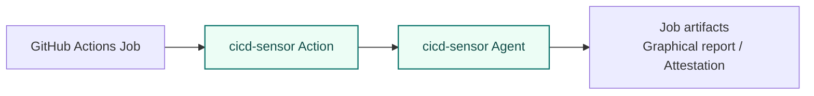
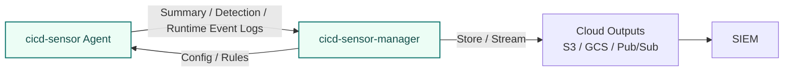

# User Guide Overview

This guide explains how to deploy cicd-sensor into CI/CD pipelines and use it for runtime detection, recording, and verification.

The first decision is the runner environment you want to protect.

## What to read

| Runner environment | Start here | What you get |
| --- | --- | --- |
| GitHub-hosted runner | [GitHub-hosted runner](github-hosted.md) | Graphical report and runtime-trace attestation predicate. Log delivery is also available when using the manager. |
| GitHub Actions self-hosted | [Self-hosted Machine install](self-hosted-install.md), [GitHub Actions self-hosted](github-self-hosted.md), [Manager](manager.md) | Summary Log, Detection Log, Runtime Event Log, and graphical report |
| GitLab CI/CD self-hosted | [Self-hosted Machine install](self-hosted-install.md), [GitLab CI/CD self-hosted](gitlab-ci.md), [Manager](manager.md) | Summary Log, Detection Log, and Runtime Event Log |
| Rule author / SIRT | [Rules](rules.md) | Detection, collection, and correlation rules for CI/CD runtime events |
| Log consumer / SIEM integration | [Logging](logging.md) | Log format delivered by the manager |

## Usage models

### GitHub-hosted runner

On GitHub-hosted runners, add `cicd-sensor/cicd-sensor-action` to the workflow.
The agent starts inside the job and observes runtime activity from the following steps.

When a manager is configured, GitHub-hosted runners can also deliver Summary Logs, Detection Logs, and Runtime Event Logs to cloud-side outputs.
The job can still produce report and attestation artifacts.

### Self-hosted runner with Manager

For Self-hosted Machine Runners and GitLab Runner fleets, install the cicd-sensor Agent and Docker proxy on the runner host, then use the manager for config, rules, and log delivery.

In self-hosted deployments, config and rules come from the manager, not from the local repository.

## Platform support

| Platform | Environment | Status |
| --- | --- | --- |
| GitHub Actions | GitHub-hosted runner | Supported target |
| GitHub Actions | Self-hosted Machine Runner | Supported target |
| GitHub Actions | Actions Runner Controller on Kubernetes | Planned |
| GitLab CI/CD | Self-hosted Docker executor | Supported target |
| GitLab CI/CD | Self-hosted Kubernetes executor | Planned |
| GitLab CI/CD | Self-hosted Shell executor | Not planned |
| GitLab CI/CD | GitLab-hosted runner | Not supported due to technical constraints |

GitLab-hosted runners are not supported today because cicd-sensor cannot install the Agent on the runner host.
