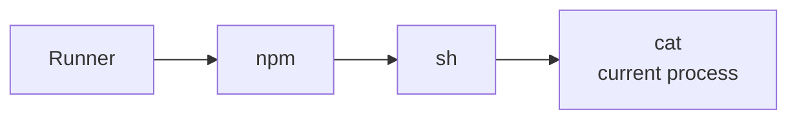
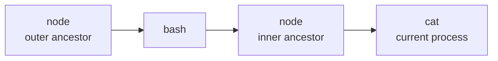

# CEL conditions

`condition` is written in [Common Expression Language (CEL)](https://cel.dev/).

```yaml
rule_sets:
  - ruleset_id: acme/process
    rules:
      - rule_id: shell_download
        event_type: process_exec
        condition: |
          process.exec_path.endsWith("/bash") &&
          process.argv.exists(arg, arg == "-c") &&
          process.argv.exists(arg, arg.contains("curl"))
        action: detect
```

## Basic operators

| operator | Example | Meaning |
| --- | --- | --- |
| `==` | `protocol == "tcp"` | equal |
| `!=` | `process.exec_path != "/usr/bin/git"` | not equal |
| `&&` | `is_read && path.endsWith("/.npmrc")` | and |
| `||` | `remote_port == 80 || remote_port == 443` | or |
| `!` | `!is_folder` | not |
| `<`, `<=`, `>`, `>=` | `remote_port >= 1024` | numeric comparison |

Use parentheses to make compound conditions explicit.

```yaml
condition: |
  protocol == "tcp" &&
  (
    remote_port == 80 ||
    remote_port == 443
  )
```

## String matching

Use `startsWith`, `endsWith`, and `contains` for strings.

```yaml
condition: process.exec_path.endsWith("/curl")
```

```yaml
condition: path.startsWith("/home/runner/work/")
```

```yaml
condition: domain.endsWith(".example.com")
```

String literals and event values are lowercased and NFC-normalized.
Regex `matches()` is not supported.

## Lists

Define values under RuleSet `lists`, then use them with `list.<name>.exists(...)`.

```yaml
rule_sets:
  - ruleset_id: acme/files
    lists:
      credential_paths:
        - /.npmrc
        - /.pypirc
        - /.docker/config.json
    rules:
      - rule_id: credential_file_read
        event_type: file_open
        condition: |
          is_read &&
          list.credential_paths.exists(s, path.endsWith(s))
        action: collect
```

`list.<name>` must be defined in `lists` within the same RuleSet.
An undefined list is a validation error.

## Process arguments

`process.argv` is a list(string).
Use `exists` to check whether a value is present.

```yaml
condition: process.argv.exists(arg, arg == "--publish")
```

```yaml
condition: process.argv.exists(arg, arg.startsWith("--registry="))
```

```yaml
condition: |
  process.argv.exists(arg, arg.contains("curl")) &&
  process.argv.exists(arg, arg.contains("|")) &&
  process.argv.exists(arg, arg.contains("bash"))
```

Index access is not supported.
Expressions such as `process.argv[0]` are rejected by the validator.

## Process ancestors

`process.ancestors` is the ancestor snapshot list attached to the event process context.
It is ordered from the current process outward: parent, grandparent, and so on.
Use `exists` to search across the ancestors visible within the job, not only the immediate parent.

Example: process started through a shell.

```yaml
condition: |
  process.ancestors.exists(parent,
    parent.exec_path.endsWith("/sh") ||
    parent.exec_path.endsWith("/bash")
  )
```

You can also inspect ancestor argv.

```yaml
condition: |
  process.ancestors.exists(parent,
    parent.exec_path.endsWith("/bash") &&
    parent.argv.exists(arg, arg == "-c")
  )
```

Example: process started by `npm install`. Multiple checks on the same ancestor go inside one `exists` predicate.

```yaml
condition: |
  process.ancestors.exists(parent,
    parent.exec_path.endsWith("/npm") &&
    parent.argv.exists(arg, arg == "install")
  )
```

Each ancestor also exposes `descendants`.
It contains only the processes forked below that ancestor on the path to the current process.
The list is ordered from that ancestor toward the current process: parent -> child.
The current process itself is not included.

`descendants` is useful in many process-chain rules.
For example, a suspicious npm post-install script starts a shell, and that shell starts the process that triggers the event:



When the current process is `cat`, the ancestors and descendants look like this.
The process tree runs left to right, while `process.ancestors` is listed from the current process outward:

```text
process.ancestors = [sh, npm, Runner]

sh.descendants     = []
npm.descendants    = [sh]
Runner.descendants = [npm, sh]
```

If the same executable appears more than once in the chain, `descendants` depends on which ancestor matched.
It is not grouped by executable name; it is only the path from the selected ancestor toward the current process.



For that event, the repeated `node` processes are separate ancestor nodes:

```text
process.ancestors = [node, bash, node]

inner node.descendants = []
bash.descendants       = [node]
outer node.descendants = [bash, node]
```

For detections, avoid anchoring only on a basename such as `node`.
Combine `exec_path` with `argv` or package-manager lifecycle context so the rule matches the intended ancestor.

Example: detect an event that happened under a shell launched by an npm post-install script.
The event process can be `cat`, `curl`, `node`, or another child of that shell; the rule only requires that a shell exists below the npm ancestor.

```yaml
condition: |
  process.ancestors.exists(parent,
    parent.exec_path.endsWith("/npm") &&
    parent.argv.exists(arg, arg == "install") &&
    parent.descendants.exists(child,
      child.exec_path.endsWith("/sh") ||
      child.exec_path.endsWith("/bash")
    )
  )
```

Ancestors are important for security rules.
In CI/CD jobs, the same binary can mean different things depending on whether a developer explicitly ran it or it was launched indirectly by a package install script or build script.

## Network and IP

Use `inIpRange(ip, cidr)` for CIDR checks.
The CIDR must be written as a literal string.

```yaml
condition: inIpRange(remote_ip, "10.0.0.0/8")
```

Example: connection to private addresses.

```yaml
condition: |
  family == "ipv4" &&
  (
    inIpRange(remote_ip, "10.0.0.0/8") ||
    inIpRange(remote_ip, "172.16.0.0/12") ||
    inIpRange(remote_ip, "192.168.0.0/16")
  )
```

`inIpRange` does not match hostname-like values.
Invalid CIDR strings are validation errors.

## Credential access patterns

Example: collect credential file reads.

```yaml
condition: |
  is_read &&
  (
    path.endsWith("/.npmrc") ||
    path.endsWith("/.pypirc") ||
    path.endsWith("/.docker/config.json")
  )
```

Example: access to environment files.

```yaml
condition: |
  is_read &&
  (
    path.endsWith("/.env") ||
    path.contains("/secrets/")
  )
```

## Unsupported CEL features

cicd-sensor rule CEL is intentionally limited to the surface that can be evaluated predictably as runtime security rules.

| Unsupported | Example |
| --- | --- |
| regex | `path.matches(".*secret.*")` |
| size | `size(process.argv) > 3` |
| index access | `process.argv[0] == "bash"` |
| arithmetic | `remote_port + 1 == 444` |
| `has()` | `has(process.exec_path)` |
| `all`, `filter`, `map`, `exists_one` | `process.argv.all(arg, arg != "")` |

Use `exists` when searching lists or argv values.
